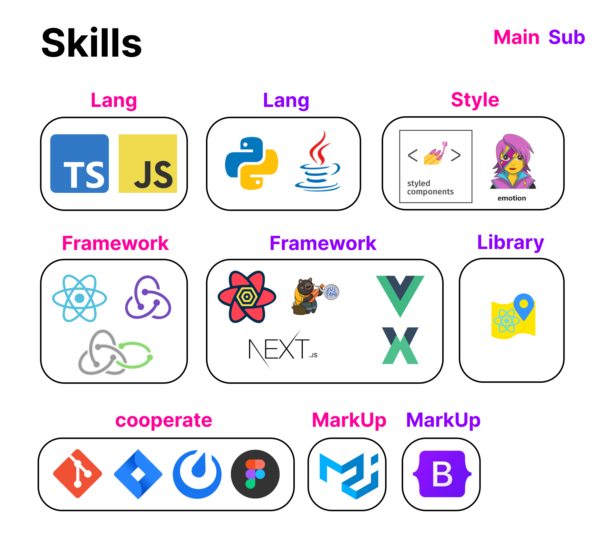

<link rel="stylesheet" type="text/css" href="style.css">

	<h2>👌 React를 통해서 Think를 보여주는 FE, 한승준</h2>
	<header>
        <h3>1. 인터뷰 요청을 통해서 사용자들의 Think를 보여줍니다.</h3>
        <ul>
            <li>4개의 프로젝트를 하면서, 저는 서비스를 이용하는 사람이 가장 중요하다고 생각하여 매번 인터뷰를 요청했습니다.</li>
            <li>기간에 따라서 1주에 8번이상의 인터뷰를 통해서 UI/UX 및 기획에서도 피드백을 받았습니다.</li>
        </ul>
        <h3>2. 성능을 고려하여, 서비스의 안정성을 높입니다.</h3>
        <ul>
            <li>해당 안정성을 위해서 다음의 방법으로 렌더링 성능을 항상 고려했습니다:
            <ul>
                <li>컴포넌트 재사용과 useCallback 및 useMemo 등의 Hook 사용</li>
            </ul>
            </li>
            <li>또한 비동기처리를 통해서 HTTP 요청에 대한 안정성도 고려하였습니다:
            <ul>
                <li>async/await 를 통해서 요청 성공 여부에 따른 비동기 처리 및 (Redux-Saga) function*을 통해서 1개의 이벤트에 2가지 이상 HTTP 요청 처리</li>
            </ul>
            </li>
            <li>해당 성능 최적화를 통해서 LightHouse 성능을 최소 90점까지 일부 향상 시켰고, 리팩토링을 통해서 진행 중에 있습니다. (2023.07 ~ 현재 진행 중)</li>
        </ul>
        <h3>3. 전문성을 추구 -> 개발에 대한 재미 -> 꾸준한 학습 태도</h3>
        <ul>
            <li>인사 총무 업무 수행 시, 코딩을 접하게 되는 계기 발생</li>
            <li>실패했지만, 전문성이 느껴지는 경험이었음</li>
            <li>회사 다니면서 지속적으로 코딩을 하게 되었음</li>
            <li>잘해지면서 개발에 대한 재미를 느끼게 됨</li>
            <li>위의 사이클을 통해서 꾸준한 학습 태도를 지니게 되었음</li>
        </ul>
    </header>

    <h2>🧑‍💻 스킬</h2>
    

 

 

	<h2>📒 포트폴리오 및 기술블로그</h2>
	
     
	 

 

  <h2>🏆 백준 랭크</h2>

  <a href="https://solved.ac/hanseungjune">
    
  </a>

   

<b>현재 &#8594; Java, Python</b>

 

<h2>✏️ Most Recent Velog Posts(벨로그 최근 게시물)</h2>

	
<h2>🕙 Velog Posts... </h2>	
	
|번호|제목|날짜|상태|
|:---:|:---:|:---:|:---:|
|430|<a href="https://velog.io/@hanseungjune/Java-JS2668%EC%88%AB%EC%9E%90%EA%B3%A0%EB%A5%B4%EA%B8%B0">[Java, JS]_2668_숫자고르기</a>|2023년 7월 5일|Public|
|429|<a href="https://velog.io/@hanseungjune/Java-JS14719%EB%B9%97%EB%AC%BC">[Java, JS]_14719_빗물</a>|2023년 7월 4일|Public|
|428|<a href="https://velog.io/@hanseungjune/WantedWeek2-1%EB%A0%8C%EB%8D%94%EB%A7%81-rzxol85h">[Wanted]_Week2-1_useEffect & Context API</a>|2023년 7월 4일|Public|
|427|<a href="https://velog.io/@hanseungjune/WantedWeek2-1%EB%A0%8C%EB%8D%94%EB%A7%81">[Wanted]_Week2-1_React 렌더링 최적화 & Advanced Hook</a>|2023년 7월 4일|Public|
|426|<a href="https://velog.io/@hanseungjune/WantedWeek2-1%EA%B3%BC%EC%A0%9C-%ED%94%BC%EB%93%9C%EB%B0%B1">[Wanted]_Week2-1_과제 피드백</a>|2023년 7월 4일|Public|
|425|<a href="https://velog.io/@hanseungjune/Java-JS11000%EA%B0%95%EC%9D%98%EC%8B%A4-%EB%B0%B0%EC%A0%95">[Java, JS]_11000_강의실 배정</a>|2023년 7월 3일|Public|
|424|<a href="https://velog.io/@hanseungjune/Next.js%ED%94%84%EB%A1%9C%EC%A0%9D%ED%8A%B8-%EC%83%9D%EC%84%B1-%ED%9B%84-README">[Next.js]_프로젝트 생성 후, README...?</a>|2023년 7월 3일|Public|
|423|<a href="https://velog.io/@hanseungjune/Wanted%EC%BB%A4%EB%A6%AC%EC%96%B4%EC%BD%94%EC%B9%AD-1%EC%A3%BC%EC%B0%A8">[Wanted]_커리어코칭 1주차</a>|2023년 7월 3일|Public|
|422|<a href="https://velog.io/@hanseungjune/CICDGithub-Action">[CI/CD]_Github Action</a>|2023년 7월 3일|Public|
|421|<a href="https://velog.io/@hanseungjune/AWSS3-%EB%B0%B0%ED%8F%AC">[AWS]_S3 배포</a>|2023년 7월 2일|Public|
|420|<a href="https://velog.io/@hanseungjune/Java-JS14226%EC%9D%B4%EB%AA%A8%ED%8B%B0%EC%BD%98">[Java, JS]_14226_이모티콘</a>|2023년 7월 2일|Public|
|419|<a href="https://velog.io/@hanseungjune/Java-JS1068%ED%8A%B8%EB%A6%AC">[Java, JS]_1068_트리</a>|2023년 7월 1일|Public|
|418|<a href="https://velog.io/@hanseungjune/WantedCICD-with-GitHub-Actions">[Wanted]_CI/CD with GitHub Actions</a>|2023년 6월 30일|Public|
|417|<a href="https://velog.io/@hanseungjune/Wanted%EC%84%9C%EB%B2%84%EC%99%80-%ED%81%B4%EB%9D%BC%EC%9A%B0%EB%93%9C-%EC%BB%B4%ED%93%A8%ED%8C%85-%EA%B7%B8%EB%A6%AC%EA%B3%A0-AWS">[Wanted]_서버와 클라우드 컴퓨팅 그리고 AWS</a>|2023년 6월 30일|Public|
|416|<a href="https://velog.io/@hanseungjune/Wanted%EC%BB%A4%EB%A6%AC%EC%96%B4-%ED%8A%B9%EA%B0%95">[Wanted]_커리어 특강</a>|2023년 6월 29일|Private|
|415|<a href="https://velog.io/@hanseungjune/Java-JS2589%EB%B3%B4%EB%AC%BC%EC%84%AC">[Java, JS]_2589_보물섬</a>|2023년 6월 28일|Public|
|414|<a href="https://velog.io/@hanseungjune/Java-JS5639%EC%9D%B4%EC%A7%84-%EA%B2%80%EC%83%89-%ED%8A%B8%EB%A6%AC">[Java, JS]_5639_이진 검색 트리</a>|2023년 6월 28일|Public|
|413|<a href="https://velog.io/@hanseungjune/Wanted%EA%B3%BC%EC%A0%9C%EB%A5%BC-%ED%95%98%EA%B8%B0%EC%97%90-%EC%95%9E%EC%84%9C-%EC%95%8C%EC%95%84%EC%95%BC-%ED%95%A0-%ED%8C%80%EC%9C%BC%EB%A1%9C-%EC%9D%BC%ED%95%98%EB%8A%94-%EB%B2%95-%EA%B0%9C%EB%B0%9C%EC%9E%90%EC%9D%98-%EA%B8%B0%EB%B3%B8%EA%B8%B0">[Wanted]_과제를 하기에 앞서 알아야 할 팀으로 일하는 법, 개발자의 기본기</a>|2023년 6월 27일|Public|
|412|<a href="https://velog.io/@hanseungjune/Wanted%EC%9D%B4%EB%A0%A5%EC%84%9C-%ED%8A%B9%EA%B0%95">[Wanted]_이력서 특강</a>|2023년 6월 26일|Private|
|411|<a href="https://velog.io/@hanseungjune/Java-JS2467%EC%9A%A9%EC%95%A1">[Java, JS]_2467_용액</a>|2023년 6월 25일|Public|
|410|<a href="https://velog.io/@hanseungjune/Java-JS2667%EB%8B%A8%EC%A7%80%EB%B2%88%ED%98%B8%EB%B6%99%EC%9D%B4%EA%B8%B0">[Java, JS]_2667_단지번호붙이기</a>|2023년 6월 25일|Public|
|409|<a href="https://velog.io/@hanseungjune/%EC%A7%81%EB%AC%B4%EB%A9%B4%EC%A0%91Promise%EC%99%80-Callback-%EC%B0%A8%EC%9D%B4%EB%A5%BC-%EC%84%A4%EB%AA%85%ED%95%B4%EC%A3%BC%EC%84%B8%EC%9A%94">[기술면접]_프론트엔드_문제_은행_30선 + &(1)</a>|2023년 6월 23일|Public|
|408|<a href="https://velog.io/@hanseungjune/Java-JS2606%EB%B0%94%EC%9D%B4%EB%9F%AC%EC%8A%A4">[Java, JS]_2606_바이러스</a>|2023년 6월 23일|Public|
|407|<a href="https://velog.io/@hanseungjune/%EC%9E%90%EB%A3%8C%EA%B5%AC%EC%A1%B0DFSBFS">[자료구조]_DFS/BFS</a>|2023년 6월 23일|Public|
|406|<a href="https://velog.io/@hanseungjune/Java-JS2178%EB%AF%B8%EB%A1%9C-%ED%83%90%EC%83%89">[Java, JS]_2178_미로 탐색</a>|2023년 6월 23일|Public|
|405|<a href="https://velog.io/@hanseungjune/Java-JS1260DFS%EC%99%80-BFS">[Java, JS]_1260_DFS와 BFS</a>|2023년 6월 19일|Public|
|404|<a href="https://velog.io/@hanseungjune/Java-JS16953A-B">[Java, JS]_16953_A → B</a>|2023년 6월 17일|Public|
|403|<a href="https://velog.io/@hanseungjune/Java-JS2583%EC%98%81%EC%97%AD-%EA%B5%AC%ED%95%98%EA%B8%B0">[Java, JS]_2583_영역 구하기</a>|2023년 6월 16일|Public|
|402|<a href="https://velog.io/@hanseungjune/Java-JS7562%EB%82%98%EC%9D%B4%ED%8A%B8%EC%9D%98-%EC%9D%B4%EB%8F%99">[Java, JS]_7562_나이트의 이동</a>|2023년 6월 15일|Public|
|401|<a href="https://velog.io/@hanseungjune/%EC%9E%90%EB%A3%8C%EA%B5%AC%EC%A1%B0%EC%97%B0%EA%B2%B0%EB%A6%AC%EC%8A%A4%ED%8A%B8">[자료구조]_연결리스트</a>|2023년 6월 15일|Public|
|400|<a href="https://velog.io/@hanseungjune/Java-JS6603%EB%A1%9C%EB%98%90">[Java, JS]_6603_로또</a>|2023년 6월 13일|Public|
|399|<a href="[https://velog.io/@hanseungjune/%EC%A7%81%EB%AC%B4%EB%A9%B4%EC%A0%91%EC%A7%88%EB%AC%B8%EB%A6%AC%EC%8A%A4%ED%8A%B8](https://velog.io/@hanseungjune/%EC%9D%B8%EC%84%B1%EB%A9%B4%EC%A0%91)">[면접]_인성면접</a>|2023년 6월 9일|Private|
|398|<a href="https://velog.io/@hanseungjune/%EC%9D%B8%EC%84%B1%EB%A9%B4%EC%A0%91%EC%A7%88%EB%AC%B8%EB%A6%AC%EC%8A%A4%ED%8A%B8">[면접은행]_FE_인성면접_질문리스트_모음집</a>|2023년 6월 9일|Private|
|397|<a href="https://velog.io/@hanseungjune/%EC%A7%81%EB%AC%B4%EB%A9%B4%EC%A0%91%EC%A7%88%EB%AC%B8%EB%A6%AC%EC%8A%A4%ED%8A%B8">[면접은행]_FE_직무면접_질문리스트_모음집</a>|2023년 6월 8일|Private|
|396|<a href="https://velog.io/@hanseungjune/%EB%A9%B4%EC%A0%91%EC%A7%81%EB%AC%B4%EB%A9%B4%EC%A0%91">[면접]_직무면접</a>|2023년 6월 8일|Public|
|395|<a href="https://velog.io/@hanseungjune/%EB%A9%B4%EC%A0%91%EC%8A%A4%ED%94%BC%EC%B9%98%EC%84%B8%EC%85%98">[면접]_면접스피치_세션</a>|2023년 6월 7일|Public|
|394|<a href="https://velog.io/@hanseungjune/%ED%9A%8C%EA%B3%A01%EB%85%84%EA%B0%84-%EB%82%98%EC%9D%98-SSAFY-%EC%83%9D%ED%99%9C">[회고]_1년간 나의 SSAFY 생활</a>|2023년 6월 1일|Public|
|393|<a href="https://velog.io/@hanseungjune/Recoli-Recoil-Docs-Basic">[Recoli] Recoil Docs - Basic</a>|2023년 4월 16일|Public|
|392|<a href="https://velog.io/@hanseungjune/React-Cannot-update-a-component-Batcher-while-rendering-a-different-component">[React] Cannot update a component (`Batcher`) while rendering a different component</a>|2023년 4월 15일|Public|
|391|<a href="https://velog.io/@hanseungjune/ReactuseMemo%EC%99%80-useCallback">[React]_useMemo와 useCallback</a>|2023년 4월 9일|Public|
|390|<a href="https://velog.io/@hanseungjune/TypeScript%ED%8E%98%EC%9D%B4%EC%A7%80%EB%84%A4%EC%9D%B4%EC%85%98">[TypeScript]_페이지네이션</a>|2023년 3월 27일|Public|
|389|<a href="https://velog.io/@hanseungjune/TypeScript%EC%9D%B4%EB%AF%B8%EC%A7%80-%EC%84%9C%EB%B2%84%EB%A1%9C-%EB%B3%B4%EB%82%BC%EB%95%8C">[TypeScript]_이미지 서버로 보낼때</a>|2023년 3월 26일|Public|
|388|<a href="https://velog.io/@hanseungjune/Redux-saga-JSTodoList">[Redux-saga, JS]_TodoList</a>|2023년 3월 13일|Public|
|387|<a href="https://velog.io/@hanseungjune/Redux-JStodoList">[Redux, JS]_todoList</a>|2023년 3월 11일|Public|
|386|<a href="https://velog.io/@hanseungjune/ReduxTypeScriptCounter">[Redux,TypeScript]_Counter</a>|2023년 3월 7일|Public|
|385|<a href="https://velog.io/@hanseungjune/TypeScriptUtility-Types">[TypeScript]_Utility Types</a>|2023년 3월 5일|Public|
|384|<a href="https://velog.io/@hanseungjune/TypeScriptGenerics">[TypeScript]_Generics</a>|2023년 3월 5일|Public|
|383|<a href="https://velog.io/@hanseungjune/TypeScriptClass">[TypeScript]_Class</a>|2023년 3월 5일|Public|
|382|<a href="https://velog.io/@hanseungjune/TypeScriptLiteralUnionInterSection">[TypeScript]_Literal&Union&InterSection</a>|2023년 3월 5일|Public|
|381|<a href="https://velog.io/@hanseungjune/TypeScriptfunction">[TypeScript]_function</a>|2023년 3월 4일|Public|
|380|<a href="https://velog.io/@hanseungjune/TypeScriptInterface">[TypeScript]_Interface</a>|2023년 3월 4일|Public|
|379|<a href="https://velog.io/@hanseungjune/TypeScriptenum">[TypeScript]_enum</a>|2023년 3월 4일|Public|
|378|<a href="https://velog.io/@hanseungjune/Solidity%EA%B8%B0%EB%B3%B8-%ED%81%AC%EB%A6%BD%ED%86%A0-%ED%86%A0%ED%81%B0-%EA%B5%AC%EC%B6%95%ED%95%98%EA%B8%B0">[Solidity]_기본 크립토 토큰 구축하기</a>|2023년 3월 2일|Public|
|377|<a href="https://velog.io/@hanseungjune/Solidity%EC%9C%A0%EC%96%B8%EC%9E%A5-%EC%8A%A4%EB%A7%88%ED%8A%B8-%EA%B3%84%EC%95%BD">[Solidity]_유언장 스마트 계약</a>|2023년 2월 27일|Public|
|376|<a href="https://velog.io/@hanseungjune/Redux%EB%82%B4%EA%B0%80-%EB%B0%B0%EC%9B%8C%EC%95%BC%ED%95%98%EB%8A%94-Effect-%EB%B0%8F-%EC%A0%9C%EB%84%88%EB%A0%88%EC%9D%B4%ED%84%B0-%ED%95%A8%EC%88%98-%EB%AA%A8%EC%9D%8C%EC%A7%91">[Redux]_내가 모아놓은 Effect 및 제너레이터 함수 모음집</a>|2023년 2월 16일|Public|
|375|<a href="https://velog.io/@hanseungjune/TSJS%EC%97%90%EC%84%9C-TS%EB%A1%9C-%EB%B3%80%ED%99%98-%EC%97%B0%EC%8A%B5%ED%95%98%EA%B8%B0">[TS]_JS에서 TS로 변환 연습하기</a>|2023년 2월 15일|Public|
|374|<a href="https://velog.io/@hanseungjune/ReactAxios">[React]_Axios</a>|2023년 2월 14일|Public|
|373|<a href="https://velog.io/@hanseungjune/ReactApp.js-%EC%84%A4%EC%A0%95">[React]_App.js 설정</a>|2023년 2월 11일|Public|
|372|<a href="https://velog.io/@hanseungjune/Python%EB%AC%B8%EB%B2%95-%EC%A4%91%EC%97%90-%ED%97%B7%EA%B0%88%EB%A6%AC%EB%8A%94-%EA%B2%83-%EB%AA%A8%EC%9D%8C%EC%A7%91">[Python]_문법 중에 헷갈리는 것 모음집!</a>|2023년 2월 6일|Public|
|371|<a href="https://velog.io/@hanseungjune/JSObject.assign-Object.freeze-Immutable.js">[JS]_Object.assign & Object.freeze & Immutable.js</a>|2023년 1월 31일|Public|
|370|<a href="https://velog.io/@hanseungjune/SassWebpack-%EA%B0%9C%EB%B0%9C-%ED%99%98%EA%B2%BD%EC%97%90%EC%84%9C-Sass-%EC%82%AC%EC%9A%A9%ED%95%98%EA%B8%B0">[Sass]_Webpack 개발 환경에서 Sass 사용하기</a>|2023년 1월 2일|Public|
|369|<a href="https://velog.io/@hanseungjune/SassSass%EA%B0%80-%EC%A0%9C%EA%B3%B5%ED%95%98%EB%8A%94-%EA%B8%B0%EB%B3%B8-%EB%82%B4%EC%9E%A5-%ED%95%A8%EC%88%98">[Sass]_Sass가 제공하는 기본 내장 함수</a>|2023년 1월 2일|Public|
|368|<a href="https://velog.io/@hanseungjune/SassNesting-import-extend-%EC%A1%B0%EA%B1%B4%EA%B3%BC-%EB%B0%98%EB%B3%B5-Mixin-Function">[Sass]_Nesting, import, extend, 조건과 반복, Mixin, Function</a>|2023년 1월 2일|Public|
|367|<a href="https://velog.io/@hanseungjune/SassCSS%EB%A5%BC-%ED%94%84%EB%A1%9C%EA%B7%B8%EB%9E%98%EB%B0%8D-%EC%96%B8%EC%96%B4%EC%99%80-%EA%B0%99%EC%9D%B4-%EC%9E%91%EC%84%B1%ED%95%A0-%EC%88%98-%EC%9E%88%EA%B2%8C-%ED%99%95%EC%9E%A5%ED%95%9C-SassScript">[Sass]_CSS를 프로그래밍 언어와 같이 작성할 수 있게 확장한 SassScript</a>|2023년 1월 2일|Public|
|366|<a href="https://velog.io/@hanseungjune/SassSass%EC%9D%98-%EC%86%8C%EA%B0%9C-%EC%84%A4%EC%B9%98%EC%99%80-%EA%B0%84%EB%8B%A8%ED%95%9C-%EB%AA%85%EB%A0%B9%EC%96%B4-%EC%82%AC%EC%9A%A9%EB%B2%95">[Sass]_Sass의 소개, 설치와 간단한 명령어 사용법</a>|2023년 1월 1일|Public|
|365|<a href="https://velog.io/@hanseungjune/BootstrapBootstrap-%EA%B7%B8%EB%A6%AC%EB%93%9C-%EC%8B%9C%EC%8A%A4%ED%85%9C">[Bootstrap]_Bootstrap 그리드 시스템</a>|2023년 1월 1일|Public|
|364|<a href="https://velog.io/@hanseungjune/%EB%B9%84%EC%A0%84%EA%B3%B5%EC%9E%90%EC%9D%98-BootStrap%EC%A4%80%EB%B9%84Bootstrap-%EC%86%8C%EA%B0%9C%EC%99%80-%EC%84%A4%EC%B9%98">[Bootstrap]_Bootstrap 소개와 설치</a>|2022년 12월 31일|Public|
|363|<a href="https://velog.io/@hanseungjune/%EB%B9%84%EC%A0%84%EA%B3%B5%EC%9E%90%EC%9D%98-CSS%EC%A4%80%EB%B9%84image-%EC%9A%94%EC%86%8C-%EC%95%84%EB%9E%98%EC%97%90-%ED%8C%A8%EB%94%A9%EB%90%9C-%EC%97%AC%EB%B6%84%EC%9D%98-%EA%B3%B5%EA%B0%84-%EC%A0%9C%EA%B1%B0%ED%95%98%EA%B8%B0">[CSS]_image 요소 아래에 패딩된 여분의 공간 제거하기</a>|2022년 12월 31일|Public|
|362|<a href="https://velog.io/@hanseungjune/%EB%B9%84%EC%A0%84%EA%B3%B5%EC%9E%90%EC%9D%98-CSS%EC%A4%80%EB%B9%84%EC%88%98%ED%8F%89%EC%88%98%EC%A7%81-%EC%A4%91%EC%95%99-%EC%A0%95%EB%A0%AC">[CSS]_수평/수직 중앙 정렬</a>|2022년 12월 31일|Public|
|361|<a href="https://velog.io/@hanseungjune/%EB%B9%84%EC%A0%84%EA%B3%B5%EC%9E%90%EC%9D%98-CSS%EC%A4%80%EB%B9%84%ED%94%8C%EB%A0%89%EC%8A%A4-%EB%B0%95%EC%8A%A4-%EB%A0%88%EC%9D%B4%EC%95%84%EC%9B%83">[CSS]_플렉스 박스 레이아웃</a>|2022년 12월 31일|Public|
|360|<a href="https://velog.io/@hanseungjune/%EB%B9%84%EC%A0%84%EA%B3%B5%EC%9E%90%EC%9D%98-CSS%EC%A4%80%EB%B9%84%EB%B0%98%EC%9D%91%ED%98%95-%EB%A0%88%EC%9D%B4%EC%95%84%EC%9B%83">[CSS]_반응형 레이아웃</a>|2022년 12월 31일|Public|
|359|<a href="https://velog.io/@hanseungjune/%EB%B9%84%EC%A0%84%EA%B3%B5%EC%9E%90%EC%9D%98-CSS%EC%A4%80%EB%B9%84%EB%A0%88%EC%9D%B4%EC%95%84%EC%9B%83">[CSS]_레이아웃</a>|2022년 12월 31일|Public|
|358|<a href="https://velog.io/@hanseungjune/%EB%B9%84%EC%A0%84%EA%B3%B5%EC%9E%90%EC%9D%98-CSS%EC%A4%80%EB%B9%84%EC%9B%B9%EB%94%94%EC%9E%90%EC%9D%B8-%ED%83%80%EC%9D%B4%ED%8F%AC%EA%B7%B8%EB%9E%98%ED%94%BCTypography">[CSS]_웹디자인 타이포그래피(Typography)</a>|2022년 12월 31일|Public|
|357|<a href="https://velog.io/@hanseungjune/%EB%B9%84%EC%A0%84%EA%B3%B5%EC%9E%90%EC%9D%98-CSS%EC%A4%80%EB%B9%84%ED%8A%B8%EB%9E%9C%EC%8A%A4%ED%8F%BC">[CSS]_트랜스폼</a>|2022년 12월 31일|Public|
|356|<a href="https://velog.io/@hanseungjune/%EB%B9%84%EC%A0%84%EA%B3%B5%EC%9E%90%EC%9D%98-CSS%EC%A4%80%EB%B9%84%EC%95%A0%EB%8B%88%EB%A9%94%EC%9D%B4%EC%85%98">[CSS]_애니메이션</a>|2022년 12월 31일|Public|
|355|<a href="https://velog.io/@hanseungjune/%EB%B9%84%EC%A0%84%EA%B3%B5%EC%9E%90%EC%9D%98-CSS%EC%A4%80%EB%B9%84%ED%8A%B8%EB%9E%9C%EC%A7%80%EC%85%98">[CSS]_트랜지션</a>|2022년 12월 31일|Public|
|354|<a href="https://velog.io/@hanseungjune/%EB%B9%84%EC%A0%84%EA%B3%B5%EC%9E%90%EC%9D%98-CSS%EC%A4%80%EB%B9%84%EA%B7%B8%EB%A0%88%EC%9D%B4%EB%94%94%EC%96%B8%ED%8A%B8">[CSS]_그레이디언트</a>|2022년 12월 31일|Public|
|353|<a href="https://velog.io/@hanseungjune/%EB%B9%84%EC%A0%84%EA%B3%B5%EC%9E%90%EC%9D%98-CSS%EC%A4%80%EB%B9%84%EA%B7%B8%EB%A6%BC%EC%9E%90">[CSS]_그림자</a>|2022년 12월 30일|Public|
|352|<a href="https://velog.io/@hanseungjune/%EB%B9%84%EC%A0%84%EA%B3%B5%EC%9E%90%EC%9D%98-CSS%EC%A4%80%EB%B9%84%EB%B2%A4%EB%8D%94-%ED%94%84%EB%A6%AC%ED%94%BD%EC%8A%A4">[CSS]_벤더 프리픽스</a>|2022년 12월 30일|Public|
|351|<a href="https://velog.io/@hanseungjune/%EB%B9%84%EC%A0%84%EA%B3%B5%EC%9E%90%EC%9D%98-CSS%EC%A4%80%EB%B9%84%EC%8A%A4%ED%83%80%EC%9D%BC%EC%9D%98-%EC%83%81%EC%86%8D%EA%B3%BC-%EC%A0%81%EC%9A%A9-%EC%9A%B0%EC%84%A0-%EC%88%9C%EC%9C%84-51wpe1rs">[CSS]_스타일의 상속과 적용 우선 순위</a>|2022년 12월 30일|Public|
|350|<a href="https://velog.io/@hanseungjune/%EB%B9%84%EC%A0%84%EA%B3%B5%EC%9E%90%EC%9D%98-IT%EC%A4%80%EB%B9%84%EC%9A%94%EC%86%8C-%EC%A0%95%EB%A0%AC">[CSS]_요소 정렬</a>|2022년 12월 30일|Public|
|349|<a href="https://velog.io/@hanseungjune/%EB%B9%84%EC%A0%84%EA%B3%B5%EC%9E%90%EC%9D%98-IT%EC%A4%80%EB%B9%84%EC%9A%94%EC%86%8C%EC%9D%98-%EC%9C%84%EC%B9%98-%EC%A0%95%EC%9D%98">[CSS]_요소의 위치 정의</a>|2022년 12월 30일|Public|
|348|<a href="https://velog.io/@hanseungjune/%EB%B9%84%EC%A0%84%EA%B3%B5%EC%9E%90%EC%9D%98-IT%EC%A4%80%EB%B9%84%ED%8F%B0%ED%8A%B8%EC%99%80-%ED%85%8D%EC%8A%A4%ED%8A%B8">[CSS]_폰트와 텍스트</a>|2022년 12월 29일|Public|
|347|<a href="https://velog.io/@hanseungjune/%EB%B9%84%EC%A0%84%EA%B3%B5%EC%9E%90%EC%9D%98-IT%EC%A4%80%EB%B9%84%EB%B0%B1%EA%B7%B8%EB%9D%BC%EC%9A%B4%EB%93%9C">[CSS]_백그라운드</a>|2022년 12월 28일|Public|
|346|<a href="https://velog.io/@hanseungjune/%EB%B9%84%EC%A0%84%EA%B3%B5%EC%9E%90%EC%9D%98-IT%EC%A4%80%EB%B9%84display-visibility-opacity-%ED%94%84%EB%A1%9C%ED%8D%BC%ED%8B%B0">[CSS]_display, visibility, opacity 프로퍼티</a>|2022년 12월 28일|Public|
|345|<a href="https://velog.io/@hanseungjune/%EB%B9%84%EC%A0%84%EA%B3%B5%EC%9E%90%EC%9D%98-IT%EC%A4%80%EB%B9%84%EB%B0%95%EC%8A%A4-%EB%AA%A8%EB%8D%B8">[CSS]_박스 모델</a>|2022년 12월 28일|Public|
|344|<a href="https://velog.io/@hanseungjune/%EB%B9%84%EC%A0%84%EA%B3%B5%EC%9E%90%EC%9D%98-IT%EC%A4%80%EB%B9%84CSS-%ED%94%84%EB%A1%9C%ED%8D%BC%ED%8B%B0-%EA%B0%92%EC%9D%98-%EB%8B%A8%EC%9C%84">[CSS]_CSS 프로퍼티 값의 단위</a>|2022년 12월 27일|Public|
|343|<a href="https://velog.io/@hanseungjune/%EB%B9%84%EC%A0%84%EA%B3%B5%EC%9E%90%EC%9D%98-IT%EC%A4%80%EB%B9%84%EC%85%80%EB%A0%89%ED%84%B0">[CSS]_셀렉터</a>|2022년 12월 26일|Public|
|342|<a href="https://velog.io/@hanseungjune/%EB%B9%84%EC%A0%84%EA%B3%B5%EC%9E%90%EC%9D%98-IT%EC%A4%80%EB%B9%84CSS-%EA%B8%B0%EB%B3%B8-%EB%AC%B8%EB%B2%95">[CSS]_CSS 기본 문법</a>|2022년 12월 25일|Public|
|341|<a href="https://velog.io/@hanseungjune/%EB%B9%84%EC%A0%84%EA%B3%B5%EC%9E%90%EC%9D%98-IT%EC%A4%80%EB%B9%84%EC%9B%B9%ED%8E%98%EC%9D%B4%EC%A7%80%EC%9D%98-%EB%A0%88%EC%9D%B4%EC%95%84%EC%9B%83%EC%9D%84-%EA%B5%AC%EC%84%B1%ED%95%98%EA%B8%B0-%EC%9C%84%ED%95%B4-%EA%B3%B5%EA%B0%84%EC%9D%84-%EB%B6%84%ED%95%A0%ED%95%98%EB%8A%94-%ED%83%9C%EA%B7%B8">[HTML]_웹페이지의 레이아웃을 구성하기 위해 공간을 분할하는 태그</a>|2022년 12월 24일|Public|
|340|<a href="https://velog.io/@hanseungjune/%EB%B9%84%EC%A0%84%EA%B3%B5%EC%9E%90%EC%9D%98-IT%EC%A4%80%EB%B9%84%EC%82%AC%EC%9A%A9%EC%9E%90%EC%99%80%EC%9D%98-%EC%BB%A4%EB%AE%A4%EB%8B%88%EC%BC%80%EC%9D%B4%EC%85%98%EC%9D%84-%EC%9C%84%ED%95%9C-%ED%8F%BC-%ED%83%9C%EA%B7%B8">[HTML]_사용자와의 커뮤니케이션을 위한 폼 태그</a>|2022년 12월 24일|Public|
|339|<a href="https://velog.io/@hanseungjune/%EB%B9%84%EC%A0%84%EA%B3%B5%EC%9E%90%EC%9D%98-IT%EC%A4%80%EB%B9%84%EC%9D%B4%EB%AF%B8%EC%A7%80%EC%9D%98-%ED%91%9C%ED%98%84%EA%B3%BC-%EB%8F%99%EC%98%81%EC%83%81-%EC%9D%8C%EC%95%85-%EB%93%B1-%EB%A9%80%ED%8B%B0%EB%AF%B8%EB%94%94%EC%96%B4%EB%A5%BC-%EC%A7%80%EC%9B%90%ED%95%98%EB%8A%94-%ED%83%9C%EA%B7%B8">[HTML]_이미지의 표현과 동영상, 음악 등 멀티미디어를 지원하는 태그</a>|2022년 12월 23일|Public|
|338|<a href="https://velog.io/@hanseungjune/%EB%B9%84%EC%A0%84%EA%B3%B5%EC%9E%90%EC%9D%98-IT%EC%A4%80%EB%B9%84%EB%AA%A9%EB%A1%9DList%EC%99%80-%ED%91%9CTable-%ED%98%95%EC%8B%9D-%ED%91%9C%ED%98%84%EC%9D%84-%EC%9C%84%ED%95%9C-%ED%83%9C%EA%B7%B8">[HTML]_목록(List)와 표(Table) 형식 표현을 위한 태그</a>|2022년 12월 23일|Public|
|337|<a href="https://velog.io/@hanseungjune/%EB%B9%84%EC%A0%84%EA%B3%B5%EC%9E%90%EC%9D%98-IT%EC%A4%80%EB%B9%84HTML%EC%9D%98-%ED%95%B5%EC%8B%AC-%EA%B0%9C%EB%85%90%EC%9D%B8-Hyperlink">[HTML]_HTML의 핵심 개념인 Hyperlink</a>|2022년 12월 23일|Public|
|336|<a href="https://velog.io/@hanseungjune/%EB%B9%84%EC%A0%84%EA%B3%B5%EC%9E%90%EC%9D%98-IT%EC%A4%80%EB%B9%84%ED%85%8D%EC%8A%A4%ED%8A%B8-%EA%B4%80%EB%A0%A8-%ED%83%9C%EA%B7%B8">[HTML]_텍스트 관련 태그</a>|2022년 12월 23일|Public|
|335|<a href="https://velog.io/@hanseungjune/%EB%B9%84%EC%A0%84%EA%B3%B5%EC%9E%90%EC%9D%98-IT%EC%A4%80%EB%B9%84%EC%9B%B9%ED%8E%98%EC%9D%B4%EC%A7%80%EC%9D%98-%EA%B5%AC%EC%84%B1%ED%95%98%EB%8A%94-%EA%B8%B0%EB%B3%B8-%ED%83%9C%EA%B7%B8">[HTML]_웹페이지의 구성하는 기본 태그</a>|2022년 12월 23일|Public|
|334|<a href="https://velog.io/@hanseungjune/%EB%B9%84%EC%A0%84%EA%B3%B5%EC%9E%90%EC%9D%98-IT%EC%A4%80%EB%B9%84%EC%8B%9C%EB%A7%A8%ED%8B%B1-%EC%9A%94%EC%86%8C%EC%99%80-%EA%B2%80%EC%83%89-%EC%97%94%EC%A7%84">[HTML]_시맨틱 요소와 검색 엔진</a>|2022년 12월 23일|Public|
|333|<a href="https://velog.io/@hanseungjune/%EB%B9%84%EC%A0%84%EA%B3%B5%EC%9E%90%EC%9D%98-IT-%EC%A4%80%EB%B9%84HTML5-%EA%B8%B0%EB%B3%B8-%EB%AC%B8%EB%B2%95">[HTML]_HTML5 기본 문법</a>|2022년 12월 23일|Public|
|332|<a href="https://velog.io/@hanseungjune/%EB%B9%84%EC%A0%84%EA%B3%B5%EC%9E%90%EC%9D%98-IT%EC%A4%80%EB%B9%84%ED%94%84%EB%A1%A0%ED%8A%B8%EC%97%94%EB%93%9C-%EA%B0%9C%EB%B0%9C%EC%9E%90-%ED%95%99%EC%8A%B5-%EB%B0%A9%ED%96%A5">[HTML]_프론트엔드 개발자 학습 방향</a>|2022년 12월 23일|Public|
|331|<a href="https://velog.io/@hanseungjune/%EB%B9%84%EC%A0%84%EA%B3%B5%EC%9E%90%EC%9D%98-IT%EC%A4%80%EB%B9%84%ED%94%84%EB%A1%A0%ED%8A%B8%EC%97%94%EB%93%9C-%EB%A1%9C%EB%93%9C%EB%A7%B5">[비전공자의 IT준비]_프론트엔드 로드맵</a>|2022년 12월 21일|Public|
|330|<a href="https://velog.io/@hanseungjune/%EC%95%8C%EA%B3%A0%EB%A6%AC%EC%A6%98SQL-%EA%B8%B0%EB%B3%B8-%EB%AC%B8%EB%B2%95">[알고리즘]_SQL 기본 문법</a>|2023년 3월 16일|Public|
|329|<a href="https://velog.io/@hanseungjune/%EC%95%8C%EA%B3%A0%EB%A6%AC%EC%A6%98%EC%8A%A4%ED%83%9D-30">[알고리즘]_스택 50</a>|2023년 3월 16일|Public|
|328|<a href="https://velog.io/@hanseungjune/%EC%95%8C%EA%B3%A0%EB%A6%AC%EC%A6%98%EA%B3%A8%EB%93%9C%EB%B0%94%ED%9D%90%EC%9D%98-%EC%B6%94%EC%B8%A1">[알고리즘]_골드바흐의 추측</a>|2023년 3월 9일|Public|
|327|<a href="https://velog.io/@hanseungjune/%EC%95%8C%EA%B3%A0%EB%A6%AC%EC%A6%98%EC%95%8C%EA%B3%A0%EB%A6%AC%EC%A6%98-%EC%82%AC%EC%A0%843">[알고리즘]_알고리즘 사전(3)</a>|2022년 10월 23일|Public|
|326|<a href="https://velog.io/@hanseungjune/%EC%95%8C%EA%B3%A0%EB%A6%AC%EC%A6%98%EC%95%8C%EA%B3%A0%EB%A6%AC%EC%A6%98-%EC%82%AC%EC%A0%842">[알고리즘]_알고리즘 사전(2)</a>|2022년 10월 20일|Public|
|325|<a href="https://velog.io/@hanseungjune/%EC%95%8C%EA%B3%A0%EB%A6%AC%EC%A6%98%EC%95%8C%EA%B3%A0%EB%A6%AC%EC%A6%98-%EC%82%AC%EC%A0%841">[알고리즘]_알고리즘 사전(1)</a>|2022년 10월 19일|Public|
|324|<a href="https://velog.io/@hanseungjune/%EA%B3%B5%ED%86%B5-%EB%B6%80%ED%8A%B8%EC%BA%A0%ED%94%84%EC%95%84%ED%82%A4%ED%85%8D%EC%B3%90-%EA%B7%B8%EB%A6%AC%EA%B8%B0%EC%99%80-%EC%9A%B0%EC%88%98-PJT-%EC%86%8C%EA%B0%9C-%EC%9B%B9-IoT-%EB%AA%A8%EB%B0%94%EC%9D%BC">[공통 부트캠프]_아키텍쳐 그리기와 우수 PJT 소개 : 웹 IoT & 모바일</a>|2023년 1월 6일|Private|
|323|<a href="https://velog.io/@hanseungjune/%EA%B3%B5%ED%86%B5-%EB%B6%80%ED%8A%B8%EC%BA%A0%ED%94%84-Project-Management">[공통 부트캠프] - Project Management</a>|2023년 1월 5일|Private|
|322|<a href="https://velog.io/@hanseungjune/%EA%B3%B5%ED%86%B5-%EB%B6%80%ED%8A%B8%EC%BA%A0%ED%94%84Jira-%EB%B0%8F-JQL-%ED%99%9C%EC%9A%A9">[공통 부트캠프]_Jira 및 JQL 활용</a>|2023년 1월 5일|Private|
|321|<a href="https://velog.io/@hanseungjune/%EA%B3%B5%ED%86%B5-%EB%B6%80%ED%8A%B8%EC%BA%A0%ED%94%84PJT-%EA%B8%B0%ED%9A%8D-%EC%8B%9C-%EC%9C%A0%EC%9D%98%EC%A0%90%EA%B3%BC-%EC%9A%B0%EC%88%98-PJT-%EC%86%8C%EA%B0%9C-%EC%9B%B9%EA%B8%B0%EC%88%A0-%EC%9B%B9%EB%94%94%EC%9E%90%EC%9D%B8">[공통 부트캠프]_PJT 기획 시 유의점과 우수 PJT 소개 : 웹기술 & 웹디자인</a>|2023년 1월 5일|Private|
|320|<a href="https://velog.io/@hanseungjune/%EB%A6%AC%EC%95%A1%ED%8A%B8-%ED%8A%B9%EA%B0%951%EC%9D%BC%EC%B0%A8">[리액트 특강]_1일차</a>|2023년 1월 4일|Private|
|319|<a href="https://velog.io/@hanseungjune/2%ED%95%99%EA%B8%B0-%EA%B3%84%EC%A0%88%ED%95%99%EA%B8%B0%EA%B3%B5%EC%9C%A0Day-%EC%95%88%EB%82%B4">[2학기 계절학기]_공유Day 안내</a>|2022년 12월 30일|Private|
|318|<a href="https://velog.io/@hanseungjune/2%ED%95%99%EA%B8%B0-%EA%B3%84%EC%A0%88%ED%95%99%EA%B8%B0CS%ED%95%99%EC%8A%B5%EA%B0%80%EC%9D%B4%EB%93%9C-%EC%86%8C%EA%B0%9C">[2학기 계절학기]_CS학습가이드 소개</a>|2022년 12월 29일|Private|
|317|<a href="https://velog.io/@hanseungjune/%ED%95%84%EC%88%98%EA%B3%BC%EC%A0%9C%EB%82%B4-%EC%95%88%EB%93%9C%EB%A1%9C%EC%9D%B4%EB%93%9C-%EC%95%B1%EC%97%90-%EA%B5%AC%EA%B8%80%EB%A7%B5-%EB%9D%84%EC%9A%B0%EA%B8%B0">[필수과제]_내 안드로이드 앱에 구글맵 띄우기</a>|2022년 12월 28일|Private|
|316|<a href="https://velog.io/@hanseungjune/2%ED%95%99%EA%B8%B0-%EA%B3%84%EC%A0%88%ED%95%99%EA%B8%B0%EA%B3%B5%ED%86%B5PJT-%ED%8A%B8%EB%9E%99-%EB%B0%8F-%EB%AA%85%EC%84%B8%EC%84%9C-%EC%86%8C%EA%B0%9C">[2학기 계절학기]_공통PJT 트랙 및 명세서 소개</a>|2022년 12월 28일|Private|
|315|<a href="https://velog.io/@hanseungjune/2%ED%95%99%EA%B8%B0-%EA%B3%84%EC%A0%88%ED%95%99%EA%B8%B0%EA%B3%B5%ED%86%B5PJT-%ED%8C%80%EA%B5%AC%EC%84%B1-%EA%B0%80%EC%9D%B4%EB%93%9C">[2학기 계절학기]_공통PJT 팀구성 가이드</a>|2022년 12월 27일|Private|
|314|<a href="https://velog.io/@hanseungjune/%EC%84%A0%ED%83%9D%EA%B3%BC%EC%A0%9C%EC%9B%B9-%EC%96%B4%ED%94%8C%EB%A6%AC%EC%BC%80%EC%9D%B4%EC%85%98-%EC%BA%90%EC%8B%9C-%EC%A0%81%EC%9A%A9">[선택과제]_웹 어플리케이션 캐시 적용</a>|2022년 12월 27일|Private|
|313|<a href="https://velog.io/@hanseungjune/%EC%84%A0%ED%83%9D%EA%B3%BC%EC%A0%9C%ED%8C%8C%EC%9D%B4%EC%8D%AC-API-%EB%8D%B0%EC%9D%B4%ED%84%B0-%ED%81%AC%EB%A1%A4%EB%9F%AC-%EA%B5%AC%ED%98%84%ED%95%B4%EB%B3%B4%EA%B8%B0">[선택과제]_파이썬 API 데이터 크롤러 구현해보기</a>|2022년 12월 27일|Private|
|312|<a href="https://velog.io/@hanseungjune/%EC%84%A0%ED%83%9D%EA%B3%BC%EC%A0%9CPostgreSQL-%EC%82%AC%EC%9A%A9%ED%95%B4-%EB%B3%B4%EA%B8%B0">[선택과제]_PostgreSQL 사용해 보기</a>|2022년 12월 26일|Private|
|311|<a href="https://velog.io/@hanseungjune/%EC%84%A0%ED%83%9D%EA%B3%BC%EC%A0%9C%ED%9A%A8%EC%9C%A8%EC%A0%81%EC%9D%B8-%EC%95%8C%EA%B3%A0%EB%A6%AC%EC%A6%98-%EC%84%A4%EA%B3%84%EC%99%80-%EC%88%9C%EC%84%9C%EB%8F%84Flowchart-%EC%9D%98%EC%82%AC%EC%BD%94%EB%93%9Cpseudo-code-%EC%9E%91%EC%84%B1">[선택과제]_효율적인 알고리즘 설계와 순서도(Flowchart), 의사코드(pseudo-code) 작성</a>|2022년 12월 26일|Private|
|310|<a href="https://velog.io/@hanseungjune/%EC%84%A0%ED%83%9D%EA%B3%BC%EC%A0%9C%EB%B9%84%EB%8F%99%EA%B8%B0-%ED%94%84%EB%A1%9C%EA%B7%B8%EB%9E%98%EB%B0%8D-%EC%9D%B4%ED%95%B4">[필수과제]_비동기 프로그래밍 이해</a>|2022년 12월 26일|Private|
|309|<a href="https://velog.io/@hanseungjune/%EC%84%A0%ED%83%9D%EA%B3%BC%EC%A0%9C%EC%BD%94%EB%94%A9-%EC%BB%A8%EB%B2%A4%EC%85%98-%EC%A0%95%EB%A6%AC%ED%95%B4%EB%B3%B4%EA%B8%B0">[필수과제]_코딩 컨벤션 정리해보기</a>|2022년 12월 26일|Private|
|308|<a href="https://velog.io/@hanseungjune/%EC%84%A0%ED%83%9D%EA%B3%BC%EC%A0%9CDatabase-%EC%84%A4%EA%B3%84-%EB%B0%8F-SQL-%EC%9E%91%EC%84%B1-ghdo2eny">[필수과제]_DB 설계 ERD 작성 실습</a>|2022년 12월 26일|Private|
|307|<a href="https://velog.io/@hanseungjune/%EC%84%A0%ED%83%9D%EA%B3%BC%EC%A0%9CDatabase-%EC%84%A4%EA%B3%84-%EB%B0%8F-SQL-%EC%9E%91%EC%84%B1">[선택과제]_Database 설계 및 SQL 작성</a>|2022년 12월 26일|Private|
|306|<a href="https://velog.io/@hanseungjune/%EC%84%A0%ED%83%9D%EA%B3%BC%EC%A0%9C%EC%82%AC%EC%9A%A9%EC%9E%90-%EC%8A%A4%ED%86%A0%EB%A6%ACUser-Story-%EC%9E%91%EC%84%B1">[선택과제]_사용자 스토리(User Story) 작성</a>|2022년 12월 26일|Private|
|305|<a href="https://velog.io/@hanseungjune/%ED%95%84%EC%88%98%EA%B3%BC%EC%A0%9C1%ED%95%99%EA%B8%B0%EC%99%80-2%ED%95%99%EA%B8%B0%EC%9D%98-%EC%B0%A8%EC%9D%B4-SSAFY-GIT-%EC%8B%A4%EC%8A%B5">[필수과제]_1학기와 2학기의 차이 & SSAFY GIT 실습</a>|2022년 12월 26일|Private|
|304|<a href="https://velog.io/@hanseungjune/2%ED%95%99%EA%B8%B0-%EA%B3%84%EC%A0%88%ED%95%99%EA%B8%B0%EC%98%A4%EB%A6%AC%EC%97%94%ED%85%8C%EC%9D%B4%EC%85%98">[2학기 계절학기]_오리엔테이션</a>|2022년 12월 26일|Private|
|303|<a href="https://velog.io/@hanseungjune/%EC%9E%A1%ED%8E%98%EC%96%B4-%ED%8A%B9%EA%B0%95%ED%95%B4%EC%99%B8%EC%B7%A8%EC%97%85-%ED%8A%B9%EA%B0%95">[잡페어 특강]_해외취업 특강</a>|2022년 12월 23일|Private|
|302|<a href="https://velog.io/@hanseungjune/%EC%9E%A1%ED%8E%98%EC%96%B4-%ED%8A%B9%EA%B0%95AI-%EB%A9%B4%EC%A0%91-%ED%8A%B9%EA%B0%95">[잡페어 특강]_AI 면접 특강</a>|2022년 12월 23일|Private|
|301|<a href="https://velog.io/@hanseungjune/%EC%9E%A1%ED%8E%98%EC%96%B4-%EC%83%81%EB%8B%B4%EB%AA%A8%EC%9D%98%EB%A9%B4%EC%A0%91">[잡페어 상담]_모의면접</a>|2022년 12월 22일|Private|
|300|<a href="https://velog.io/@hanseungjune/%EC%9E%A1%ED%8E%98%EC%96%B4-%EC%83%81%EB%8B%B4IT-%ED%8F%AC%ED%8A%B8%ED%8F%B4%EB%A6%AC%EC%98%A4">[잡페어 상담]_IT 포트폴리오</a>|2022년 12월 22일|Private|
|299|<a href="https://velog.io/@hanseungjune/%EC%9E%A1%ED%8E%98%EC%96%B4-%ED%8A%B9%EA%B0%95AI-%EC%9E%90%EC%86%8C%EC%84%9C">[잡페어 특강]_AI 자소서</a>|2022년 12월 22일|Private|
|298|<a href="https://velog.io/@hanseungjune/%EC%9E%A1%ED%8E%98%EC%96%B4-%ED%8A%B9%EA%B0%95%EC%B7%A8%EC%97%85%EC%97%AD%EB%9F%89-%EC%A7%84%EB%8B%A8-%EA%B2%B0%EA%B3%BC-%ED%95%B4%EC%84%9D-8%EA%B8%B0">[잡페어 특강]_취업역량 진단 결과 해석 (8기)</a>|2022년 12월 20일|Private|
|297|<a href="https://velog.io/@hanseungjune/%EC%9E%A1%ED%8E%98%EC%96%B4-%ED%8A%B9%EA%B0%95OPIC%ED%8A%B9%EA%B0%95-%EC%A4%91%EA%B8%89">[잡페어 특강]_OPIC특강 (중급)</a>|2022년 12월 19일|Private|
|296|<a href="https://velog.io/@hanseungjune/%EC%9E%A1%ED%8E%98%EC%96%B4-%ED%8A%B9%EA%B0%95SW%EC%A7%81%EB%AC%B4%EB%B6%84%EC%84%9D">[잡페어 특강]_SW직무분석</a>|2022년 12월 15일|Private|
|295|<a href="https://velog.io/@hanseungjune/%EC%9E%A1%ED%8E%98%EC%96%B4-%ED%8A%B9%EA%B0%95%EC%9E%90%EA%B8%B0%EC%86%8C%EA%B0%9C%EC%84%9C-%EC%9E%91%EC%84%B1%EB%B2%95">[잡페어 특강]_자기소개서 작성법</a>|2022년 12월 15일|Private|
|294|<a href="https://velog.io/@hanseungjune/%EC%9E%A1%ED%8E%98%EC%96%B4-%ED%8A%B9%EA%B0%95%EC%9D%B8%EC%84%B1%EB%A9%B4%EC%A0%91-%EC%A0%84%EB%9E%B5">[잡페어 특강]_인성면접 전략</a>|2022년 12월 14일|Private|
|293|<a href="https://velog.io/@hanseungjune/JobFairBizmind">[잡페어 특강]_Biz_mind</a>|2022년 12월 14일|Private|
|292|<a href="https://velog.io/@hanseungjune/CS%ED%95%B5%EC%8B%AC%EC%9D%B4%EB%A1%A0%EC%8B%AC%ED%99%94-%EC%9D%B4%EB%A1%A0">[CS핵심이론]_심화 이론</a>|2022년 12월 13일|Private|
|291|<a href="https://velog.io/@hanseungjune/%EC%9E%A1%ED%8E%98%EC%96%B4-%ED%8A%B9%EA%B0%95%EC%A7%81%EB%AC%B4-%EB%A9%B4%EC%A0%91-%ED%8A%B9%EA%B0%95">[잡페어 특강]_직무 면접 특강</a>|2022년 12월 13일|Private|
|290|<a href="https://velog.io/@hanseungjune/CS%ED%95%B5%EC%8B%AC%EC%9D%B4%EB%A1%A0%EA%B8%B0%EC%B4%88-%EC%9D%B4%EB%A1%A0">[잡페어 특강]_CS기초이론</a>|2022년 12월 12일|Private|
|289|<a href="https://velog.io/@hanseungjune/VueVueDRF">[Vue]_Vue_DRF</a>|2022년 11월 14일|Private|
|288|<a href="https://velog.io/@hanseungjune/VueVue-Router">[Vue]_Vue Router</a>|2022년 11월 9일|Private|
|287|<a href="https://velog.io/@hanseungjune/VueVuex">[Vue]_Vuex</a>|2022년 11월 7일|Private|
|286|<a href="https://velog.io/@hanseungjune/VueVue-CLI">[Vue]_Vue CLI</a>|2022년 11월 2일|Private|
|285|<a href="https://velog.io/@hanseungjune/VueVue-JS">[Vue]_Vue JS</a>|2022년 10월 31일|Private|
|284|<a href="https://velog.io/@hanseungjune/GITGIT-%EC%8B%A4%EC%8A%B5">[GIT]_GIT 실습</a>|2022년 10월 28일|Private|
|283|<a href="https://velog.io/@hanseungjune/JavaScriptAsynchronous-JS">[JavaScript]_Asynchronous JS</a>|2022년 10월 26일|Private|
|282|<a href="https://velog.io/@hanseungjune/JavaScriptJavaScript-%EC%8B%AC%ED%99%94">[JavaScript]_JavaScript 심화</a>|2022년 10월 24일|Private|
|281|<a href="https://velog.io/@hanseungjune/JavaScriptJavaScript-%EA%B8%B0%EC%B4%88">[JavaScript]_JavaScript 기초</a>|2022년 10월 19일|Private|
|280|<a href="https://velog.io/@hanseungjune/DjangoDjangoRESTAPI">[Django]_Django_REST_API</a>|2022년 10월 18일|Private|
|279|<a href="https://velog.io/@hanseungjune/DjangoDjangoStaticMedia">[Django]_Django_Static_Media</a>|2022년 10월 13일|Private|
|278|<a href="https://velog.io/@hanseungjune/%ED%8C%8C%EC%9D%B4%EC%8D%ACDBDataBaseMN">파이썬DB_DataBase_M:N</a>|2022년 10월 12일|Private|
|277|<a href="https://velog.io/@hanseungjune/%ED%8C%8C%EC%9D%B4%EC%8D%ACDBDataBaseN1">파이썬DB_DataBase_N:1</a>|2022년 10월 9일|Private|
|276|<a href="https://velog.io/@hanseungjune/%ED%8C%8C%EC%9D%B4%EC%8D%ACDBDataBase%EA%B8%B0%EC%B4%88">파이썬DB_DataBase_기초</a>|2022년 10월 9일|Private|
|275|<a href="https://velog.io/@hanseungjune/Django-DB-prac">Django, DB-prac</a>|2022년 10월 6일|Private|
|274|<a href="https://velog.io/@hanseungjune/APS%EC%9D%91%EC%9A%A9%EA%B7%B8%EB%9E%98%ED%94%84">APS응용_그래프</a>|2022년 9월 28일|Private|
|273|<a href="https://velog.io/@hanseungjune/APS%EC%9D%91%EC%9A%A9%EB%B6%84%ED%95%A0-%EC%A0%95%EB%B3%B5-%EB%B0%B1%ED%8A%B8%EB%9E%98%ED%82%B9">APS응용_분할 정복&백트래킹</a>|2022년 9월 28일|Private|
|272|<a href="https://velog.io/@hanseungjune/APS%EC%9D%91%EC%9A%A9%EC%99%84%EC%A0%84-%EA%B2%80%EC%83%89-%EA%B7%B8%EB%A6%AC%EB%94%94">APS응용_완전 검색& 그리디</a>|2022년 9월 25일|Private|
|271|<a href="https://velog.io/@hanseungjune/%EB%93%9C%EB%94%94%EC%96%B4-%EC%95%8C%EA%B3%A0%EB%A6%AC%EC%A6%98-%EC%9D%91%EC%9A%A9-Start">드디어 알고리즘 응용 Start...</a>|2022년 9월 24일|Private|
|270|<a href="https://velog.io/@hanseungjune/9%EC%9B%94%EC%B7%A8%EC%97%85%ED%8A%B9%EA%B0%95%EC%9D%B4%EB%A0%A5%EC%84%9C-%EB%B0%8F-%EC%9E%90%EA%B8%B0%EC%86%8C%EA%B0%9C%EC%84%9C-%EC%9E%91%EC%84%B1%EB%B2%95">[9월_취업특강]_이력서 및 자기소개서 작성법</a>|2022년 9월 24일|Private|
|269|<a href="https://velog.io/@hanseungjune/Computeational-Thinking%EA%B8%B0%EC%B4%88%EB%85%BC%EB%A6%AC%EB%B0%8F%EC%88%98%ED%95%99">[Computeational Thinking]_기초논리_및_수학</a>|2022년 9월 14일|Private|
|268|<a href="https://velog.io/@hanseungjune/%EC%B6%94%EC%84%9D-%EB%81%9D-%EB%8B%A4%EC%8B%9C-%EA%B3%84%ED%9A%8D-%EC%9E%A1%EA%B8%B0">[추석 끝] 다시 계획 잡기</a>|2022년 9월 13일|Private|
|267|<a href="https://velog.io/@hanseungjune/DjangoDjangoAuthenticationCookies">[Django]_Django_Authentication&Cookies</a>|2022년 9월 13일|Private|
|266|<a href="https://velog.io/@hanseungjune/DjangoDjangoFormModelForm">[Django]_Django_Form&ModelForm</a>|2022년 9월 12일|Private|
|265|<a href="https://velog.io/@hanseungjune/DjangoDjango%EA%B8%B0%EB%B3%B8">[Django]_Django_기본</a>|2022년 9월 12일|Private|
|264|<a href="https://velog.io/@hanseungjune/DjangoDjango%EA%B8%B0%EC%B4%88">[Django]_Django_기초</a>|2022년 9월 11일|Private|
|263|<a href="https://velog.io/@hanseungjune/%EC%83%9D%EC%86%8C%ED%95%98%EC%A7%80%EB%A7%8C-%ED%94%BC%ED%95%A0-%EC%88%98-%EC%97%86%EB%8A%94-Tree">생소하지만 피할 수 없는 Tree...</a>|2022년 9월 11일|Private|
|262|<a href="https://velog.io/@hanseungjune/%EB%84%88%EB%AC%B4%EB%84%88%EB%AC%B4-%EC%8B%AB%EC%A7%80%EB%A7%8C-%EA%BC%AD-%EA%B1%B0%EC%B3%90%EA%B0%80%EC%95%BC%ED%95%98%EB%8A%94-%ED%81%90%EC%99%80-BFS">너무너무 싫지만 꼭 거쳐가야하는 큐와 BFS...</a>|2022년 9월 10일·|Private|
|261|<a href="https://velog.io/@hanseungjune/%ED%95%9C%EB%8B%A4%EA%B3%A0-%ED%96%88%EB%8A%94%EB%8D%B0-%EC%9D%B4%EC%A0%9C%EC%95%BC-%ED%95%98%EB%8A%94-%EB%B0%B1%ED%8A%B8%EB%9E%98%ED%82%B9%EA%B3%BC-%EB%B6%80%EB%B6%84%EC%A7%91%ED%95%A9">한다고 했는데 이제야 하는 백트래킹과 부분집합...</a>|2022년 9월 10일|Private|
|260|<a href="https://velog.io/@hanseungjune/8%EC%9B%94%EC%B7%A8%EC%97%85%ED%8A%B9%EA%B0%95%ED%83%80%EA%B2%9F%EA%B8%B0%EC%97%85-%EC%A0%95%EB%B3%B4%EC%A1%B0%EC%82%AC">[8월_취업특강]_타겟기업 정보조사</a>|2022년 9월 9일|Private|
|259|<a href="https://velog.io/@hanseungjune/%EB%B0%98%EC%84%B1%EB%AC%B8%EC%A7%80%EB%82%9C-%EC%8B%B8%ED%94%BC-2%EA%B0%9C%EC%9B%94%EC%9D%84-%EB%90%98%EB%8F%8C%EC%95%84%EB%B3%B4%EB%A9%B0">[반성문]_지난 싸피 2개월을 되돌아보며...</a>|2022년 9월 9일|Private|
|258|<a href="https://velog.io/@hanseungjune/%EC%95%84%EB%BF%94%EC%8B%B8-%ED%96%88%EC%A7%80%EB%A7%8C-%EB%8F%8C%EC%9D%B4%ED%82%AC-%EC%88%98-%EC%97%86%EB%8A%94-Stack%EA%B3%BC-DFS">아뿔싸 했지만, 돌이킬 수 없는 Stack과 DFS...</a>|2022년 8월 20일|Private|
|257|<a href="https://velog.io/@hanseungjune/%EB%AF%B8%EB%A6%AC-%EA%B3%B5%EB%B6%80%ED%95%B4%EC%95%BC-%EC%82%B4%EC%95%84%EB%82%A8%EC%9D%8C%EC%9D%84-%EA%B9%A8%EB%8B%AC%EC%9D%80-%EC%95%8C%EA%B3%A0%EB%A6%AC%EC%A6%98-%EB%AC%B8%EC%9E%90%EC%97%B41">미리 공부해야 살아남음을 깨달은 알고리즘 - 문자열(1)</a>|2022년 8월 12일|Private|
|256|<a href="https://velog.io/@hanseungjune/%EC%96%B4%EB%A0%A4%EC%9A%B4%EA%B1%B0-%EB%92%A4%EB%8A%A6%EA%B2%8C-%EA%B9%A8%EB%8B%AB%EA%B3%A0-%ED%97%88%EB%8D%95%EC%9D%B4%EB%8A%94-%EC%95%8C%EA%B3%A0%EB%A6%AC%EC%A6%98-%EB%B0%B0%EC%97%B42">어려운거 뒤늦게 깨닫고 허덕이는 알고리즘 - 배열2</a>|2022년 8월 10일|Private|
|255|<a href="https://velog.io/@hanseungjune/%EC%89%AC%EC%9A%B4%EC%A4%84-%EC%95%8C%EC%95%98%EB%8A%94%EB%8D%B0-%EC%96%B4%EB%A0%A4%EC%9A%B4-%EB%B0%B0%EC%97%B4-%EC%95%8C%EA%B3%A0%EB%A6%AC%EC%A6%98-%ED%95%84%EA%B8%B0">쉬운줄 알았는데 어려운 배열 알고리즘 - 필기</a>|2022년 8월 8일|Private|
|254|<a href="https://velog.io/@hanseungjune/%ED%97%B7%EA%B0%88%EB%A0%A4%EC%84%9C-%EC%95%A0%EB%A8%B9%EC%9D%80-%EA%B7%B8%EB%A6%AC%EB%93%9C%EB%B0%98%EC%9D%91%ED%98%95-%EC%9B%B9-%ED%95%84%EA%B8%B0">헷갈려서 애먹은 그리드&반응형 웹 - 필기</a>|2022년 8월 3일|Private|
|253|<a href="https://velog.io/@hanseungjune/%EB%B0%B0%EC%9B%A0%EC%A7%80%EB%A7%8C-%EB%8B%A4%EC%8B%9C-%EB%B0%B0%EC%9B%8C%EB%B3%B4%EB%8A%94-Web-%ED%95%84%EA%B8%B0">배웠지만 다시 배워보는 HTML&CSS - 필기</a>|2022년 8월 1일|Private|
|252|<a href="https://velog.io/@hanseungjune/LanguageTrack-%EC%98%A4%EB%8B%B5%EB%85%B8%ED%8A%B82">LanguageTrack : 오답노트(2)</a>|2022년 8월 1일|Private|
|251|<a href="https://velog.io/@hanseungjune/%EB%8B%A4%EC%8B%9C-%EB%B0%B0%EC%9B%8C%EB%B3%B4%EB%8A%94-Python-%ED%95%84%EA%B8%B0">다시 배워보는 Python - 필기</a>|2022년 7월 19일|Private|
|250|<a href="https://velog.io/@hanseungjune/%EC%83%88%EB%A1%9C-%EB%B0%B0%EC%9B%8C%EB%B3%B4%EB%8A%94-Python-%ED%95%84%EA%B8%B0">새로 배워보는 Python - 필기</a>|2022년 7월 20일|Private|
|249|<a href="https://velog.io/@hanseungjune/%EC%83%88%EB%A1%9C-%EB%B0%B0%EC%9B%8C%EB%B3%B4%EB%8A%94-Python-%ED%95%84%EA%B8%B02">새로 배워보는 Python - 필기(2)</a>|2022년 7월 25일|Private|
|248|<a href="https://velog.io/@hanseungjune/%EC%96%B4%EB%A0%B5%EC%A7%80%EB%A7%8C-%EB%B0%B0%EC%9B%8C%EB%B3%B4%EB%8A%94-Python-%ED%95%84%EA%B8%B0">어렵지만 배워보는 Python - 필기</a>|2022년 7월 27일|Private|
|247|<a href="https://velog.io/@hanseungjune/LanguageTrack-%EC%98%A4%EB%8B%B5%EB%85%B8%ED%8A%B81">LanguageTrack : 오답노트(1)</a>|2022년 7월 5일|Private|
|246|<a href="https://velog.io/@hanseungjune/ReactState">[React]_State</a>|2022년 6월 30일|Public|
|245|<a href="https://velog.io/@hanseungjune/ReactProps-Children-%EC%A0%95%EB%A6%AC">[React]_Props + Children 정리</a>|2022년 6월 29일|Public|
|244|<a href="https://velog.io/@hanseungjune/Reactattribute-%EB%8C%80%EC%8B%A0-children">[React]_attribute 대신 children</a>|2022년 6월 29일|Public|
|243|<a href="https://velog.io/@hanseungjune/ReactProps">[React]_Props</a>|2022년 6월 28일|Public|
|242|<a href="https://velog.io/@hanseungjune/ReactReact-Element-Component">[React]_React Element + Component</a>|2022년 6월 28일|Public|
|241|<a href="https://velog.io/@hanseungjune/React%EC%BB%B4%ED%8F%AC%EB%84%8C%ED%8A%B8-%EA%B8%B0%EB%B3%B8">[React]_컴포넌트 기본</a>|2022년 6월 27일|Public|
|240|<a href="https://velog.io/@hanseungjune/React%EB%B3%80%EC%88%98%EB%AA%85-%EA%B8%B0%EB%8A%A5">[React]_{변수명} 기능</a>|2022년 6월 27일|Public|
|239|<a href="https://velog.io/@hanseungjune/ReactFragment-or">[React]_<Fragment> or <></a>|2022년 6월 27일|Public|
|238|<a href="https://velog.io/@hanseungjune/ReactJSX">[React]_JSX</a>|2022년 6월 27일|Public|
|237|<a href="https://velog.io/@hanseungjune/ReactReact-%EC%8B%9C%EC%9E%91%ED%95%98%EA%B8%B0">[React]_React 시작하기</a>|2022년 6월 27일|Public|
|236|<a href="https://velog.io/@hanseungjune/Python%EC%88%AB%EC%9E%90%EC%95%BC%EA%B5%AC-%EC%99%84%EC%84%B1">[Python]_숫자야구 완성</a>|2022년 6월 16일|Public|
|235|<a href="https://velog.io/@hanseungjune/Python-%EC%88%AB%EC%9E%90-%EC%95%BC%EA%B5%AC-%EC%A0%90%EC%88%98-%EA%B3%84%EC%82%B0">[Python] 숫자 야구: 점수 계산</a>|2022년 6월 16일|Public|
|234|<a href="https://velog.io/@hanseungjune/Python%EC%88%AB%EC%9E%90-%EC%95%BC%EA%B5%AC-%EC%88%AB%EC%9E%90-%EC%98%88%EC%B8%A1%ED%95%98%EA%B8%B0">[Python]_숫자 야구: 숫자 예측하기</a>|2022년 6월 16일|Public|
|233|<a href="https://velog.io/@hanseungjune/Python%EC%88%AB%EC%9E%90-%EC%95%BC%EA%B5%AC-%EC%88%AB%EC%9E%90-3%EA%B0%9C-%EB%BD%91%EA%B8%B0">[Python]_숫자 야구: 숫자 3개 뽑기</a>|2022년 6월 15일|Public|
|232|<a href="https://velog.io/@hanseungjune/Python%EC%9E%90%EB%A6%BF%EC%88%98-%ED%95%A9-%EA%B5%AC%ED%95%98%EA%B8%B0-ppg6phw7">[Python]_자릿수 합 구하기</a>|2022년 6월 14일|Public|
|231|<a href="https://velog.io/@hanseungjune/Python%EB%A1%9C%EB%98%90-%EC%8B%9C%EB%AE%AC%EB%A0%88%EC%9D%B4%EC%85%98-%EB%8B%B9%EC%B2%A8%EA%B8%88-%ED%99%95%EC%9D%B8">[Python]_로또 시뮬레이션 : 당첨금 확인</a>|2022년 6월 13일|Public|
|230|<a href="https://velog.io/@hanseungjune/Python%EB%A1%9C%EB%98%90-%EC%8B%9C%EB%AE%AC%EB%A0%88%EC%9D%B4%EC%85%98-%EA%B2%B9%EC%B9%98%EB%8A%94-%EB%B2%88%ED%98%B8-%EA%B0%AF%EC%88%98-%EA%B5%AC%ED%95%98%EA%B8%B0">[Python]_로또 시뮬레이션 : 겹치는 번호 갯수 구하기</a>|2022년 6월 13일|Public|
|229|<a href="https://velog.io/@hanseungjune/Python%EB%B3%B4%EB%84%88%EC%8A%A4-%EB%B2%88%ED%98%B8-%EB%BD%91%EA%B8%B0">[Python]_로또 시뮬레이션 : 보너스 번호 뽑기</a>|2022년 6월 13일|Public|
|228|<a href="https://velog.io/@hanseungjune/Python%EB%A1%9C%EB%98%90-%EC%8B%9C%EB%AE%AC%EB%A0%88%EC%9D%B4%EC%85%98-%EB%B2%88%ED%98%B8-%EB%BD%91%EA%B8%B0">[Python]_로또 시뮬레이션: 번호 뽑기</a>|2022년 6월 13일|Public|
|227|<a href="https://velog.io/@hanseungjune/Python%EB%8B%A8%EC%96%B4%EC%9E%A5-%EB%9E%9C%EB%8D%A4%ED%95%98%EA%B2%8C-%EA%B3%84%EC%86%8D-%EB%82%98%EC%98%A4%EA%B2%8C-%ED%95%98%EA%B8%B0">[Python]_단어장 랜덤하게 계속 나오게 하기</a>|2022년 6월 13일|Public|
|226|<a href="https://velog.io/@hanseungjune/Python%EB%8B%A8%EC%96%B4%EC%9E%A5-%EB%A7%9E%EC%B6%94%EA%B8%B0">[Python]_단어장 맞추기</a>|2022년 6월 13일|Public|
|225|<a href="https://velog.io/@hanseungjune/Python%EB%8B%A8%EC%96%B4%EC%9E%A5-%EB%A7%8C%EB%93%A4%EA%B8%B0">[Python]_단어장 만들기</a>|2022년 6월 13일|Public|
|224|<a href="https://velog.io/@hanseungjune/Python%EC%BD%94%EB%94%A9%EC%97%90-%EB%B9%A0%EC%A7%84-%EB%8B%AD">[Python]_코딩에 빠진 닭</a>|2022년 6월 13일|Public|
|223|<a href="https://velog.io/@hanseungjune/Python%EC%88%AB%EC%9E%90-%EB%A7%9E%ED%9E%88%EA%B8%B0-%EA%B2%8C%EC%9E%84">[Python]_숫자 맞히기 게임</a>|2022년 6월 11일|Public|
|222|<a href="https://velog.io/@hanseungjune/Python%ED%8C%B0%EB%A6%B0%EB%93%9C%EB%A1%AC">[Python]_팰린드롬</a>|2022년 6월 11일|Public|
|221|<a href="https://velog.io/@hanseungjune/Python%EC%A3%BC%EB%AF%BC%EB%93%B1%EB%A1%9D%EB%B2%88%ED%98%B8-%EA%B0%80%EB%A6%AC%EA%B8%B0">[Python]_주민등록번호 가리기</a>|2022년 6월 11일|Public|
|220|<a href="https://velog.io/@hanseungjune/Python%ED%88%AC%ED%91%9C-%EC%A7%91%EA%B3%84%ED%95%98%EA%B8%B0">[Python]_투표 집계하기</a>|2022년 6월 11일|Public|
|219|<a href="https://velog.io/@hanseungjune/Pythonkey%EC%99%80-value-%EC%9E%90%EB%A6%AC-%EB%B0%94%EA%BE%B8%EA%B8%B0">[Python]_key와 value 자리 바꾸기</a>|2022년 6월 11일|Public|
|218|<a href="https://velog.io/@hanseungjune/Python%EC%98%81%EC%96%B4-%EB%8B%A8%EC%96%B4%EC%9E%A5%EB%94%95%EC%85%94%EB%84%88%EB%A6%AC">[Python]_영어 단어장(딕셔너리)</a>|2022년 6월 11일|Public|
|217|<a href="https://velog.io/@hanseungjune/Python%EB%A6%AC%EC%8A%A4%ED%8A%B8-%EB%92%A4%EC%A7%91%EA%B8%B0">[Python]_리스트 뒤집기</a>|2022년 6월 11일|Public|
|216|<a href="https://velog.io/@hanseungjune/Python%ED%94%BC%ED%83%80%EA%B3%A0%EB%9D%BC%EC%8A%A4-%EC%82%BC%EC%A1%B0">[Python]_피타고라스 삼조</a>|2022년 6월 10일|Public|
|215|<a href="https://velog.io/@hanseungjune/Pythonfor%EB%AC%B8%EC%9C%BC%EB%A1%9C-%EA%B5%AC%EA%B5%AC%EB%8B%A8">[Python]_for문으로 구구단</a>|2022년 6월 10일|Public|
|214|<a href="https://velog.io/@hanseungjune/Python%EA%B1%B0%EB%93%AD%EC%A0%9C%EA%B3%B1">[Python]_거듭제곱</a>|2022년 6월 10일|Public|
|213|<a href="https://velog.io/@hanseungjune/Pythonrange-%EC%97%B0%EC%8A%B5">[Python]_range 연습</a>|2022년 6월 10일|Public|
|212|<a href="https://velog.io/@hanseungjune/Python%EB%A6%AC%EC%8A%A4%ED%8A%B8-%ED%95%A8%EC%88%98-%ED%99%9C%EC%9A%A9%ED%95%98%EA%B8%B0">[Python]_리스트 함수 활용하기</a>|2022년 6월 10일|Public|
|211|<a href="https://velog.io/@hanseungjune/Python%ED%99%98%EC%A0%84-%EC%84%9C%EB%B9%84%EC%8A%A4">[Python]_환전 서비스</a>|2022년 6월 10일|Public|
|210|<a href="https://velog.io/@hanseungjune/Python%EC%98%A8%EB%8F%84-%EB%8B%A8%EC%9C%84-%EB%B0%94%EA%BE%B8%EA%B8%B0">[Python]_온도 단위 바꾸기</a>|2022년 6월 10일|Public|
|209|<a href="https://velog.io/@hanseungjune/Python%EB%A6%AC%EC%8A%A4%ED%8A%B8-%EC%9D%B8%EB%8D%B1%EC%8B%B1-%EC%97%B0%EC%8A%B5">[Python]_리스트 인덱싱 연습</a>|2022년 6월 10일|Public|
|208|<a href="https://velog.io/@hanseungjune/Python%EA%B5%AC%EA%B5%AC%EB%8B%A8">[Python]_구구단</a>|2022년 6월 10일|Public|
|207|<a href="https://velog.io/@hanseungjune/Python%ED%94%BC%EB%B3%B4%EB%82%98%EC%B9%98-%EC%88%98%EC%97%B4">[Python]_피보나치 수열</a>|2022년 6월 10일|Public|
|206|<a href="https://velog.io/@hanseungjune/Python%ED%83%9D%EC%9D%B4%EC%9D%98-%EC%9A%B0%EC%8A%B9-%EC%83%81%EA%B8%88">[Python]_택이의 우승 상금</a>|2022년 6월 10일|Public|
|205|<a href="https://velog.io/@hanseungjune/Python%EC%95%BD%EC%88%98-%EC%B0%BE%EA%B8%B0">[Python]_약수 찾기</a>|2022년 6월 10일|Public|
|204|<a href="https://velog.io/@hanseungjune/Python%EC%9D%B4%EC%83%81%ED%95%9C-%EC%88%98%ED%95%99-%EB%AC%B8%EC%A0%9C">[Python]_이상한 수학 문제</a>|2022년 6월 9일|Public|
|203|<a href="https://velog.io/@hanseungjune/Python%ED%95%99%EC%A0%90-%EA%B3%84%EC%82%B0%EA%B8%B0">[Python]_학점 계산기</a>|2022년 6월 9일|Public|
|202|<a href="https://velog.io/@hanseungjune/Pythonwhile%EB%AC%B8-%EC%97%B0%EC%8A%B5-I">[Python]_while문 연습</a>|2022년 6월 9일|Public|
|201|<a href="https://velog.io/@hanseungjune/Python%EA%B1%B0%EC%8A%A4%EB%A6%84%EB%8F%88-%EA%B3%84%EC%82%B0%EA%B8%B0">[Python]_거스름돈 계산기</a>|2022년 6월 9일|Public|
|200|<a href="https://velog.io/@hanseungjune/Python%EC%A7%9D%EC%88%98-%ED%99%80%EC%88%98">[Python]_짝수? 홀수?</a>|2022년 6월 9일|Public|
|199|<a href="https://velog.io/@hanseungjune/Python%EB%AC%B8%EC%9E%90%EC%97%B4-%ED%8F%AC%EB%A7%B7%ED%8C%85-%EC%8B%A4%EC%8A%B5">[Python]_문자열 포맷팅 실습</a>|2022년 6월 9일|Public|
|198|<a href="https://velog.io/@hanseungjune/%ED%95%AD%ED%95%B499%EC%9B%B9%EA%B0%9C%EB%B0%9C-%EC%A2%85%ED%95%A9%EB%B0%98-5%EC%A3%BC%EC%B0%A8">[항해99]_AWS_Domain_OGtag</a>|2022년 6월 8일|Public|
|197|<a href="https://velog.io/@hanseungjune/%ED%95%AD%ED%95%B499%EC%9B%B9%EA%B0%9C%EB%B0%9C-%EC%A2%85%ED%95%A9%EB%B0%98-4%EC%A3%BC%EC%B0%A8">[항해99]_(POST,GET)API코드</a>|2022년 6월 7일|Public|
|196|<a href="https://velog.io/@hanseungjune/%ED%95%AD%ED%95%B499%EC%9B%B9%EA%B0%9C%EB%B0%9C-%EC%A2%85%ED%95%A9%EB%B0%98-3%EC%A3%BC%EC%B0%A8">[항해99]_Python, Crawling, MongoDB</a>|2022년 6월 6일|Public|
|195|<a href="https://velog.io/@hanseungjune/%ED%95%AD%ED%95%B499%EC%9B%B9%EA%B0%9C%EB%B0%9C-%EC%A2%85%ED%95%A9%EB%B0%98-2%EC%A3%BC%EC%B0%A8">[항해99]_JQuery, Ajax</a>|2022년 6월 6일|Public|
|194|<a href="https://velog.io/@hanseungjune/%ED%95%AD%ED%95%B499%EC%9B%B9%EA%B0%9C%EB%B0%9C-%EC%A2%85%ED%95%A9%EB%B0%98-1%EC%A3%BC%EC%B0%A8">[항해99]_HTML,CSS,JS</a>|2022년 6월 6일|Public|
|193|<a href="https://velog.io/@hanseungjune/IT%EB%89%B4%EB%B9%84%EC%82%AC%EC%A0%84%EC%BB%B4%ED%8C%8C%EC%9D%BC%EB%9F%AC-vs.-%EC%9D%B8%ED%84%B0%ED%94%84%EB%A6%AC%ED%84%B0">[IT뉴비사전]_컴파일러 vs. 인터프리터</a>|2022년 6월 23일|Public|
|192|<a href="https://velog.io/@hanseungjune/IT%EB%89%B4%EB%B9%84%EC%82%AC%EC%A0%84%EA%B0%9C%EB%B0%9C%EC%9E%90%EB%93%A4%EC%9D%B4-%EB%A7%8E%EC%9D%B4-%EC%93%B0%EB%8A%94-%ED%94%84%EB%A1%9C%EA%B7%B8%EB%9E%A8%EB%93%A4">[IT뉴비사전]_개발자들이 많이 쓰는 프로그램들</a>|2022년 6월 22일|Public|
|191|<a href="https://velog.io/@hanseungjune/IT%EB%89%B4%EB%B9%84%EC%82%AC%EC%A0%84%EB%9D%BC%EC%9D%B4%EB%B8%8C%EB%9F%AC%EB%A6%AC-%EA%B0%9C%EB%B0%9C%EB%AC%B8%EC%84%9C-%EC%BB%A4%EB%AE%A4%EB%8B%88%ED%8B%B0-%EC%A2%8B%EC%9D%80-%EA%B0%9C%EB%B0%9C%EC%9E%90">[IT뉴비사전]_라이브러리 + 개발문서 + 커뮤니티 = 좋은 개발자</a>|2022년 6월 22일|Public|
|190|<a href="https://velog.io/@hanseungjune/IT%EB%89%B4%EB%B9%84%EC%82%AC%EC%A0%84%EC%8A%A4%ED%83%80%EC%9D%BC-%EA%B0%80%EC%9D%B4%EB%93%9C-%EC%A0%95%EB%A6%AC">[IT뉴비사전]_스타일 가이드 정리</a>|2022년 6월 22일|Public|
|189|<a href="https://velog.io/@hanseungjune/IT%EB%89%B4%EB%B9%84%EC%82%AC%EC%A0%84%ED%8A%B9%EC%88%98-%EB%AA%A9%EC%A0%81-%EC%96%B8%EC%96%B4">[IT뉴비사전]_특수 목적 언어</a>|2022년 6월 22일|Public|
|188|<a href="https://velog.io/@hanseungjune/IT%EB%89%B4%EB%B9%84%EC%82%AC%EC%A0%84%ED%94%84%EB%A1%9C%EA%B7%B8%EB%9E%98%EB%B0%8D-%EC%96%B8%EC%96%B4%EC%9D%98-%ED%9D%90%EB%A6%84">[IT뉴비사전]_프로그래밍 언어의 흐름</a>|2022년 6월 22일|Public|
|187|<a href="https://velog.io/@hanseungjune/IT%EB%89%B4%EB%B9%84%EC%82%AC%EC%A0%84%ED%94%84%EB%A1%9C%EA%B7%B8%EB%9E%98%EB%B0%8D-%EC%96%B8%EC%96%B4%EC%9D%98-%EC%A2%85%EB%A5%98-%EC%B4%9D%EC%A0%95%EB%A6%AC">[IT뉴비사전]_프로그래밍 언어의 종류 총정리</a>|2022년 6월 22일|Public|
|186|<a href="https://velog.io/@hanseungjune/IT%EB%89%B4%EB%B9%84%EC%82%AC%EC%A0%84Dynamic-typing%EA%B3%BC-Static-typing">[IT뉴비사전]_Dynamic typing과 Static typing</a>|2022년 6월 22일|Public|
|185|<a href="https://velog.io/@hanseungjune/IT%EB%89%B4%EB%B9%84%EC%82%AC%EC%A0%84%EA%B0%9D%EC%B2%B4-%EC%A7%80%ED%96%A5-%ED%94%84%EB%A1%9C%EA%B7%B8%EB%9E%98%EB%B0%8D-%EC%A0%95%EB%A6%AC%ED%95%98%EA%B8%B0">[IT뉴비사전]_객체 지향 프로그래밍 정리하기</a>|2022년 6월 22일|Public|
|184|<a href="https://velog.io/@hanseungjune/IT%EB%89%B4%EB%B9%84%EC%82%AC%EC%A0%84%ED%8A%B8%EB%A0%8C%EB%93%9C%EB%A5%BC-%EC%9D%BD%EB%8A%94-%EB%B0%A9%EB%B2%95-39dpddfz">[IT뉴비사전]_프로그래머에게 영어는 필수인가요?</a>|2022년 6월 22일|Public|
|183|<a href="https://velog.io/@hanseungjune/WordPress%ED%99%88%ED%8E%98%EC%9D%B4%EC%A7%80-%EB%A7%8C%EB%93%A4%EA%B8%B0">[WordPress]_홈페이지 만들기!</a>|2022년 6월 3일|Public|
|182|<a href="https://velog.io/@hanseungjune/GIT%EA%B9%83%EC%9C%BC%EB%A1%9C-%ED%98%91%EC%97%85%ED%95%98%EA%B8%B0">[GIT]_깃으로 협업하기!</a>|2022년 6월 3일|Public|
|181|<a href="https://velog.io/@hanseungjune/IT%EB%89%B4%EB%B9%84%EC%82%AC%EC%A0%84%ED%8A%B8%EB%A0%8C%EB%93%9C%EB%A5%BC-%EC%9D%BD%EB%8A%94-%EB%B0%A9%EB%B2%95">[IT뉴비사전]_트렌드를 읽는 방법</a>|2022년 6월 22일|Public|
|180|<a href="https://velog.io/@hanseungjune/%EC%9A%A9%EC%96%B4%EC%A0%95%EB%A6%AC%EC%84%B8%EC%85%98-%EC%BF%A0%ED%82%A4-%ED%86%A0%ED%81%B0-JWT">[IT뉴비사전]_세션? 쿠키? 토큰? JWT?</a>|2022년 6월 9일|Public|
|179|<a href="https://velog.io/@hanseungjune/UNIXPowerShell">[UNIX]_PowerShell</a>|2022년 6월 2일|Public|
|178|<a href="https://velog.io/@hanseungjune/UNIX-mntcusersa">[UNIX]_/mnt/c/users/a</a>|2022년 6월 2일|Public|
|177|<a href="https://velog.io/@hanseungjune/UNIXapt%EB%A1%9C-mc-%EC%84%A4%EC%B9%98-sudo">[UNIX]_apt로_mc_설치 + sudo</a>|2022년 6월 2일|Public|
|176|<a href="https://velog.io/@hanseungjune/UNIX%EB%AA%85%EB%A0%B9%EC%96%B4-%EB%AA%A8%EC%9D%8C%EC%A7%91">[UNIX]_명령어 모음집</a>|2022년 6월 2일|Public|
|175|<a href="https://velog.io/@hanseungjune/UNIXrm">[UNIX]_rm</a>|2022년 6월 2일|Public|
|174|<a href="https://velog.io/@hanseungjune/UNIXcp">[UNIX]_cp</a>|2022년 6월 2일|Public|
|173|<a href="https://velog.io/@hanseungjune/UNIXmv">[UNIX]_mv</a>|2022년 6월 2일|Public|
|172|<a href="https://velog.io/@hanseungjune/UNIXcatlessheadtail">[UNIX]_cat_less_head_tail</a>|2022년 6월 2일|Public|
|171|<a href="https://velog.io/@hanseungjune/UNIXVIM">[UNIX]_VIM</a>|2022년 6월 2일|Public|
|170|<a href="https://velog.io/@hanseungjune/UNIXmkdirtouch">[UNIX]_mkdir_touch</a>|2022년 6월 2일|Public|
|169|<a href="https://velog.io/@hanseungjune/UNIXls-%EC%99%80-%EA%B0%81-%EB%94%94%EB%A0%89%ED%86%A0%EB%A6%AC%EC%9D%98-%EC%84%B1%EA%B2%A9">[UNIX]_ls 와 각 디렉토리의 성격</a>|2022년 6월 1일|Public|
|168|<a href="https://velog.io/@hanseungjune/UNIX%ED%8C%8C%EC%9D%BC-%EA%B2%BD%EB%A1%9C">[UNIX]_파일 경로</a>|2022년 6월 1일|Public|
|167|<a href="https://velog.io/@hanseungjune/UNIX%ED%84%B0%EB%AF%B8%EB%84%90-%EC%82%AC%EC%9A%A9-%EA%BF%80%ED%8C%81">[UNIX]_터미널 사용 꿀팁!</a>|2022년 6월 1일|Public|
|166|<a href="https://velog.io/@hanseungjune/UNIX%EC%BB%A4%EB%A7%A8%EB%93%9C-%EB%A7%A4%EB%89%B4%EC%96%BC-man">[UNIX]_커맨드 매뉴얼 : man</a>|2022년 6월 1일|Public|
|165|<a href="https://velog.io/@hanseungjune/UNIXCommandoptionargument">[UNIX]_Command_option_argument</a>|2022년 6월 1일|Public|
|164|<a href="https://velog.io/@hanseungjune/UNIX">[UNIX]_터미널과 shell</a>|2022년 6월 1일|Public|
|163|<a href="https://velog.io/@hanseungjune/UNIX%EA%B0%80%EC%83%81%EB%A8%B8%EC%8B%A0%EC%9C%BC%EB%A1%9C-ubuntu-%EC%84%A4%EC%B9%98">[UNIX]_가상머신으로 ubuntu 설치</a>|2022년 6월 1일|Public|
|162|<a href="https://velog.io/@hanseungjune/UNIXWSL-%EC%84%A4%EC%B9%98-%EA%B3%BC%EC%A0%95">[UNIX]_WSL 설치 과정</a>|2022년 6월 1일|Public|
|161|<a href="https://velog.io/@hanseungjune/BootStrapClassimg-fluid-img-thumbnail">[BootStrap_Class]_img-fluid, img-thumbnail</a>|2022년 5월 31일|Public|
|160|<a href="https://velog.io/@hanseungjune/JavaScript%EB%A7%88%EC%9A%B0%EC%8A%A4-%EC%9D%B4%EB%8F%99-%EC%9D%B4%EB%B2%A4%ED%8A%B8I">[JavaScript]_마우스 이동 이벤트I</a>|2022년 6월 27일|Public|
|159|<a href="https://velog.io/@hanseungjune/JavaScript%EC%9D%B4%EB%B2%A4%ED%8A%B8-%EA%B4%80%EB%A0%A8-%EC%98%88%EC%A0%9C%EC%B2%AD%EA%B8%B0%EB%B0%B1%EA%B8%B0">[JavaScript]_이벤트 관련 예제(청기백기)</a>|2022년 6월 27일|Public|
|158|<a href="https://velog.io/@hanseungjune/JavaScript%EC%9D%B4%EB%B2%A4%ED%8A%B8-%EB%B0%9C%EC%83%9D-%EC%B4%9D%EC%A0%95%EB%A6%AC">[JavaScript]_이벤트 발생 총정리</a>|2022년 6월 26일|Public|
|157|<a href="https://velog.io/@hanseungjune/JavaScriptEvent-Limit%EB%A7%88%EC%9A%B0%EC%8A%A4-%EC%9A%B0%ED%81%B4%EB%A6%AD-%EC%A0%9C%ED%95%9C">[JavaScript]_Event Limit(마우스 우클릭 제한)</a>|2022년 6월 26일|Public|
|156|<a href="https://velog.io/@hanseungjune/JavaScriptEvent-Delegation">[JavaScript]_Event Delegation</a>|2022년 6월 26일|Public|
|155|<a href="https://velog.io/@hanseungjune/JavaScriptEvent-Bubbling-Capturing">[JavaScript]_Event Bubbling + Capturing</a>|2022년 6월 26일|Public|
|154|<a href="https://velog.io/@hanseungjune/JavaScriptEvent-Object">[JavaScript]_Event Object</a>|2022년 6월 26일|Public|
|153|<a href="https://velog.io/@hanseungjune/JavaScriptEvent-handler-%EC%9E%91%EB%8F%99-%EA%B3%BC%EC%A0%95-%EB%B0%8F-%EB%8B%A4%EC%96%91%ED%95%9C-%EC%9D%B4%EB%B2%A4%ED%8A%B8-%EC%A2%85%EB%A5%98">[JavaScript]_Event handler 작동 과정 및 다양한 이벤트 종류</a>|2022년 6월 26일|Public|
|152|<a href="https://velog.io/@hanseungjune/JavaScriptBrowser-ElementNode-DOM-Attribute-%EC%B4%9D%EC%A0%95%EB%A6%AC">[JavaScript]_Browser, ElementNode, DOM, Attribute 총정리</a>|2022년 6월 25일|Public|
|151|<a href="https://velog.io/@hanseungjune/JavaScript%EB%B9%84%ED%91%9C%EC%A4%80-%EC%86%8D%EC%84%B1">[JavaScript]_비표준 속성</a>|2022년 6월 25일|Public|
|150|<a href="https://velog.io/@hanseungjune/JavaScriptStyle-%EB%8B%A4%EB%A3%A8%EA%B8%B0">[JavaScript]_Style 다루기</a>|2022년 6월 25일|Public|
|149|<a href="https://velog.io/@hanseungjune/JavaScriptHTML-%EC%86%8D%EC%84%B1-%EB%8B%A4%EB%A3%A8%EA%B8%B0">[JavaScript]_HTML 속성 다루기</a>|2022년 6월 25일|Public|
|148|<a href="https://velog.io/@hanseungjune/JavaScript%EC%9A%94%EC%86%8C-%EB%85%B8%EB%93%9C">[JavaScript]_요소 노드</a>|2022년 6월 25일|Public|
|147|<a href="https://velog.io/@hanseungjune/JavaScriptDOM-%ED%8A%B8%EB%A6%AC-%EA%B0%80%EC%A1%B1%EA%B4%80%EA%B3%84">[JavaScript]_DOM 트리 가족관계</a>|2022년 6월 25일|Public|
|146|<a href="https://velog.io/@hanseungjune/JavaScriptWindow-console">[JavaScript]_Window + console</a>|2022년 6월 25일|Public|
|145|<a href="https://velog.io/@hanseungjune/JavaScriptLevel2%ED%83%9C%EA%B7%B8-%EC%84%A0%ED%83%9D-%ED%81%B4%EB%A6%AD-%EC%9D%B4%EB%B2%A4%ED%8A%B8">[JavaScript]_태그 선택 + 클릭 이벤트</a>|2022년 6월 4일|Public|
|144|<a href="https://velog.io/@hanseungjune/JS%EC%98%A4%EB%8B%B5%EB%85%B8%ED%8A%B8%ED%8C%B0%EB%A6%B0%EB%93%9C%EB%A1%AC%EC%8B%A4%EC%8A%B5">[JS_오답노트]_팰린드롬_실습</a>|2022년 6월 1일|Public|
|143|<a href="https://velog.io/@hanseungjune/JS%EC%98%A4%EB%8B%B5%EB%85%B8%ED%8A%B8%EA%B1%B0%EC%8A%A4%EB%A6%84%EB%8F%88%EC%8B%A4%EC%8A%B5">[JS_오답노트]_거스름돈_실습</a>|2022년 6월 1일|Public|
|142|<a href="https://velog.io/@hanseungjune/JS%EC%98%A4%EB%8B%B5%EB%85%B8%ED%8A%B8%ED%8C%A9%ED%86%A0%EB%A6%AC%EC%96%BC%EC%8B%A4%EC%8A%B5">[JS_오답노트]_팩토리얼_실습</a>|2022년 6월 1일|Public|
|141|<a href="https://velog.io/@hanseungjune/JS%EC%98%A4%EB%8B%B5%EB%85%B8%ED%8A%B8%EB%AC%B8%EC%9E%90%EC%97%B4-%EC%8B%AC%ED%99%94%EC%8B%A4%EC%8A%B5">[JS_오답노트]_문자열 심화_실습</a>|2022년 6월 1일|Public|
|140|<a href="https://velog.io/@hanseungjune/JS%EC%98%A4%EB%8B%B5%EB%85%B8%ED%8A%B8%EB%AC%B8%EC%9E%90%EC%97%B4%EC%8B%AC%ED%99%942">[JS_오답노트]_문자열 심화(2)</a>|2022년 6월 1일|Public|
|139|<a href="https://velog.io/@hanseungjune/JS%EC%98%A4%EB%8B%B5%EB%85%B8%ED%8A%B8%EB%AC%B8%EC%9E%90%EC%97%B4-%EC%8B%AC%ED%99%941">[JS_오답노트]_문자열 심화(1)</a>|2022년 6월 1일|Public|
|138|<a href="https://velog.io/@hanseungjune/JS%EC%98%A4%EB%8B%B5%EB%85%B8%ED%8A%B8%EC%B0%B8%EC%A1%B0%ED%98%95%EB%B3%B5%EC%82%AC%EC%8B%A4%EC%8A%B5">[JS_오답노트]_참조형복사_실습</a>|2022년 6월 1일|Public|
|137|<a href="https://velog.io/@hanseungjune/JS%EC%98%A4%EB%8B%B5%EB%85%B8%ED%8A%B8%EA%B0%9D%EC%B2%B4%EC%99%84%EC%A0%84%EB%B3%B5%EC%82%AC4">[JS_오답노트]_객체_완전복사(4)</a>|2022년 6월 1일|Public|
|136|<a href="https://velog.io/@hanseungjune/JS%EC%98%A4%EB%8B%B5%EB%85%B8%ED%8A%B8%EA%B0%9D%EC%B2%B4%EC%99%84%EC%A0%84%EB%B3%B5%EC%82%AC3">[JS_오답노트]_객체_완전복사(3)</a>|2022년 6월 1일|Public|
|135|<a href="https://velog.io/@hanseungjune/JS%EC%98%A4%EB%8B%B5%EB%85%B8%ED%8A%B8%EA%B0%9D%EC%B2%B4%EC%99%84%EC%A0%84%EB%B3%B5%EC%82%AC2">[JS_오답노트]_객체_완전복사(2)</a>|2022년 6월 1일|Public|
|134|<a href="https://velog.io/@hanseungjune/JS%EC%98%A4%EB%8B%B5%EB%85%B8%ED%8A%B8%EA%B0%9D%EC%B2%B4%EC%99%84%EC%A0%84%EB%B3%B5%EC%82%AC1">[JS_오답노트]_객체_완전복사(1)</a>|2022년 6월 1일|Public|
|133|<a href="https://velog.io/@hanseungjune/JS%EC%98%A4%EB%8B%B5%EB%85%B8%ED%8A%B8%EC%B0%B8%EC%A1%B0%ED%98%95%EC%99%84%EC%A0%84%EB%B3%B5%EC%82%AC">[JS_오답노트]_배열_완전복사</a>|2022년 6월 1일|Public|
|132|<a href="https://velog.io/@hanseungjune/JS%EC%98%A4%EB%8B%B5%EB%85%B8%ED%8A%B8%EA%B8%B0%EB%B3%B8%ED%98%95-%EB%B0%8F-%EC%B0%B8%EC%A1%B0%ED%98%95%EC%98%88%EC%A0%9C">[JS_오답노트]_기본형 및 참조형_예제</a>|2022년 6월 1일|Public|
|131|<a href="https://velog.io/@hanseungjune/JS%EC%98%A4%EB%8B%B5%EB%85%B8%ED%8A%B8%EC%B0%B8%EC%A1%B0%ED%98%95%EC%9D%B4%EB%9E%80">[JS_오답노트]_참조형이란?</a>|2022년 6월 1일|Public|
|130|<a href="https://velog.io/@hanseungjune/JS%EC%98%A4%EB%8B%B5%EB%85%B8%ED%8A%B8%EA%B8%B0%EB%B3%B8%ED%98%95%EC%9D%B4%EB%9E%80">[JS_오답노트]_기본형이란?</a>|2022년 6월 1일|Public|
|129|<a href="https://velog.io/@hanseungjune/JS%EC%98%A4%EB%8B%B5%EB%85%B8%ED%8A%B8-m6lj848s">[JS_오답노트]_for(property in object)_실습</a>|2022년 6월 1일|Public|
|128|<a href="https://velog.io/@hanseungjune/JS%EC%98%A4%EB%8B%B5%EB%85%B8%ED%8A%B8%EB%8B%A4%EC%B0%A8%EC%9B%90%EB%B0%B0%EC%97%B4%EC%8B%A4%EC%8A%B5">[JS_오답노트]_다차원배열_실습</a>|2022년 6월 1일|Public|
|127|<a href="https://velog.io/@hanseungjune/JS%EC%98%A4%EB%8B%B5%EB%85%B8%ED%8A%B8%EB%8B%A4%EC%B0%A8%EC%9B%90-%EB%B0%B0%EC%97%B4">[JS_오답노트]_다차원 배열</a>|2022년 6월 1일|Public|
|126|<a href="https://velog.io/@hanseungjune/JS%EC%98%A4%EB%8B%B5%EB%85%B8%ED%8A%B8forlet-arrayindex-of-array%EC%8B%A4%EC%8A%B5">[JS_오답노트]_for(let array[index] of array)_실습</a>|2022년 6월 1일|Public|
|125|<a href="https://velog.io/@hanseungjune/JS%EC%98%A4%EB%8B%B5%EB%85%B8%ED%8A%B8forlet-variable-of-Array">[JS_오답노트]_for(let variable of Array)</a>|2022년 6월 1일|Public|
|124|<a href="https://velog.io/@hanseungjune/JS%EC%98%A4%EB%8B%B5%EB%85%B8%ED%8A%B8%EB%B0%B0%EC%97%B4%EC%8B%A4%EC%8A%B53">[JS_오답노트]_배열_실습(3)</a>|2022년 6월 1일|Public|
|123|<a href="https://velog.io/@hanseungjune/JS%EC%98%A4%EB%8B%B5%EB%85%B8%ED%8A%B8%EB%B0%B0%EC%97%B4%EC%8B%A4%EC%8A%B52">[JS_오답노트]_배열_실습(2)</a>|2022년 6월 1일|Public|
|122|<a href="https://velog.io/@hanseungjune/JS%EC%98%A4%EB%8B%B5%EB%85%B8%ED%8A%B8%EB%B0%B0%EC%97%B4%EC%8B%A4%EC%8A%B51">[JS_오답노트]_배열_실습1</a>|2022년 6월 1일|Public|
|121|<a href="https://velog.io/@hanseungjune/JS%EC%98%A4%EB%8B%B5%EB%85%B8%ED%8A%B8%EB%B0%B0%EC%97%B44">[JS_오답노트]_배열(4)</a>|2022년 6월 1일|Public|
|120|<a href="https://velog.io/@hanseungjune/JS%EC%98%A4%EB%8B%B5%EB%85%B8%ED%8A%B8%EB%B0%B0%EC%97%B43">[JS_오답노트]_배열(3)</a>|2022년 6월 1일|Public|
|119|<a href="https://velog.io/@hanseungjune/JS%EC%98%A4%EB%8B%B5%EB%85%B8%ED%8A%B8%EB%B0%B0%EC%97%B42">[JS_오답노트]_배열(2)</a>|2022년 6월 1일|Public|
|118|<a href="https://velog.io/@hanseungjune/JS%EC%98%A4%EB%8B%B5%EB%85%B8%ED%8A%B8%EB%B0%B0%EC%97%B41">[JS_오답노트]_배열(1)</a>|2022년 6월 1일|Public|
|117|<a href="https://velog.io/@hanseungjune/JS%EC%98%A4%EB%8B%B5%EB%85%B8%ED%8A%B8%EB%B0%B0%EC%97%B4-%EA%B8%B0%EB%B3%B8%ED%98%95%ED%83%9C">[JS_오답노트]_배열 기본형태</a>|2022년 6월 1일|Public|
|116|<a href="https://velog.io/@hanseungjune/JS%EC%98%A4%EB%8B%B5%EB%85%B8%ED%8A%B8%EC%88%AB%EC%9E%90%ED%98%95-%EB%A9%94%EC%86%8C%EB%93%9C%EC%8B%A4%EC%8A%B5">[JS_오답노트]_숫자형 메소드_실습</a>|2022년 5월 31일|Public|
|115|<a href="https://velog.io/@hanseungjune/JS%EC%98%A4%EB%8B%B5%EB%85%B8%ED%8A%B8Math%EB%A9%94%EC%86%8C%EB%93%9C">[JS_오답노트]_Math메소드</a>|2022년 5월 31일|Public|
|114|<a href="https://velog.io/@hanseungjune/JS%EC%98%A4%EB%8B%B5%EB%85%B8%ED%8A%B8%EC%A7%84%EB%B2%95%EB%B3%80%ED%99%98toString">[JS_오답노트]_진법변환_toString()</a>|2022년 5월 31일|Public|
|113|<a href="https://velog.io/@hanseungjune/JS%EC%98%A4%EB%8B%B5%EB%85%B8%ED%8A%B8Number.toFixed">[JS_오답노트]_Number.toFixed()</a>|2022년 5월 31일|Public|
|112|<a href="https://velog.io/@hanseungjune/JS%EC%98%A4%EB%8B%B5%EB%85%B8%ED%8A%B8%EC%A7%80%EC%88%98%ED%91%9C%EA%B8%B0%EB%B2%95-%EB%B0%8F-%EC%A7%84%EB%B2%95">[JS_오답노트]_지수표기법 및 진법</a>|2022년 5월 31일|Public|
|111|<a href="https://velog.io/@hanseungjune/JS%EC%98%A4%EB%8B%B5%EB%85%B8%ED%8A%B8new-Date%EC%8B%A4%EC%8A%B5">[JS_오답노트]_new Date()_실습</a>|2022년 5월 31일|Public|
|110|<a href="https://velog.io/@hanseungjune/JS%EC%98%A4%EB%8B%B5%EB%85%B8%ED%8A%B8new-Date%EA%B8%B0%EB%B3%B83">[JS_오답노트]_new Date()_기본3</a>|2022년 5월 31일|Public|
|109|<a href="https://velog.io/@hanseungjune/JS%EC%98%A4%EB%8B%B5%EB%85%B8%ED%8A%B8new-Date%EA%B8%B0%EB%B3%B82">[JS_오답노트]_new Date()_기본2</a>|2022년 5월 31일|Public|
|108|<a href="https://velog.io/@hanseungjune/JS%EC%98%A4%EB%8B%B5%EB%85%B8%ED%8A%B8new-Date%EA%B8%B0%EB%B3%B8">[JS_오답노트]_new Date()_기본1</a>|2022년 5월 31일|Public|
|107|<a href="https://velog.io/@hanseungjune/JS%EC%98%A4%EB%8B%B5%EB%85%B8%ED%8A%B8%ED%95%A8%EC%88%98%EB%8A%94-%EC%A7%80%EC%97%AD-%EC%A0%84%EC%97%AD">[JS_오답노트]_함수는 지역? 전역?</a>|2022년 5월 31일|Public|
|106|<a href="https://velog.io/@hanseungjune/JS%EC%98%A4%EB%8B%B5%EB%85%B8%ED%8A%B8var">[JS_오답노트]_var</a>|2022년 5월 31일|Public|
|105|<a href="https://velog.io/@hanseungjune/JS%EC%98%A4%EB%8B%B5%EB%85%B8%ED%8A%B8let">[JS_오답노트]_let</a>|2022년 5월 31일|Public|
|104|<a href="https://velog.io/@hanseungjune/JS%EC%98%A4%EB%8B%B5%EB%85%B8%ED%8A%B8const-c7w7bz8g">[JS_오답노트]_const</a>|2022년 5월 31일|Public|
|103|<a href="https://velog.io/@hanseungjune/JS%EC%98%A4%EB%8B%B5%EB%85%B8%ED%8A%B8%EC%98%81%EC%96%B4%EB%8B%A8%EC%96%B4%EC%9E%A5%ED%94%84%EB%A1%9C%ED%8D%BC%ED%8B%B0%EA%B0%80-%ED%95%A8%EC%88%98%EC%9D%B8-%EA%B0%9D%EC%B2%B4">[JS_오답노트]_영어단어장(프로퍼티의 값이 함수인 객체)</a>|2022년 5월 31일|Public|
|102|<a href="https://velog.io/@hanseungjune/JS%EC%98%A4%EB%8B%B5%EB%85%B8%ED%8A%B8%EA%B0%9D%EC%B2%B4-%EA%B0%9C%EB%85%90-%ED%95%9C%EB%B2%88%EC%97%90-%EB%B3%B4%EA%B8%B0">[JS_오답노트]_객체 개념 한번에 보기!</a>|2022년 5월 30일|Public|
|101|<a href="https://velog.io/@hanseungjune/JS%EC%98%A4%EB%8B%B5%EB%85%B8%ED%8A%B8%ED%94%84%EB%A1%9C%ED%8D%BC%ED%8B%B0-%ED%99%95%EC%9D%B8in%EC%9C%BC%EB%A1%9C">[JS_오답노트]_프로퍼티 확인(in으로)</a>|2022년 5월 30일|Public|
|100|<a href="https://velog.io/@hanseungjune/JS%EC%98%A4%EB%8B%B5%EB%85%B8%ED%8A%B8%ED%94%84%EB%A1%9C%ED%8D%BC%ED%8B%B0-%EC%B6%94%EA%B0%80%EC%99%80-%EC%82%AD%EC%A0%9C">[JS_오답노트]_프로퍼티 추가와 삭제</a>|2022년 5월 30일|Public|
|99|<a href="https://velog.io/@hanseungjune/JS%EC%98%A4%EB%8B%B5%EB%85%B8%ED%8A%B8%EA%B0%9D%EC%B2%B4-%ED%91%9C%EA%B8%B0%EB%B2%95">[JS_오답노트]_객체 표기법</a>|2022년 5월 30일|Public|
|98|<a href="https://velog.io/@hanseungjune/JS%EC%98%A4%EB%8B%B5%EB%85%B8%ED%8A%B8%EA%B0%9D%EC%B2%B4Object">[JS_오답노트]_객체(Object)</a>|2022년 5월 30일|Public|
|97|<a href="https://velog.io/@hanseungjune/JS%EC%98%A4%EB%8B%B5%EB%85%B8%ED%8A%B8%ED%94%BC%EB%B3%B4%EB%82%98%EC%B9%98-%EC%88%98%EC%97%B4">[JS_오답노트]_피보나치 수열</a>|2022년 5월 29일|Public|
|96|<a href="https://velog.io/@hanseungjune/JS%EC%98%A4%EB%8B%B5%EB%85%B8%ED%8A%B8%EA%B5%AC%EA%B5%AC%EB%8B%A8for-while">[JS_오답노트]_구구단(for, while)</a>|2022년 5월 29일|Public|
|95|<a href="https://velog.io/@hanseungjune/JS%EC%98%A4%EB%8B%B5%EB%85%B8%ED%8A%B8While%EB%AC%B8">[JS_오답노트]_While문</a>|2022년 5월 29일|Public|
|94|<a href="https://velog.io/@hanseungjune/JS%EC%98%A4%EB%8B%B5%EB%85%B8%ED%8A%B8Switch%EB%AC%B8">[JS_오답노트]_Switch문</a>|2022년 5월 29일|Public|
|93|<a href="https://velog.io/@hanseungjune/JS%EC%98%A4%EB%8B%B5%EB%85%B8%ED%8A%B8IF%EB%AC%B8-%EC%98%88%EC%A0%9C2">[JS_오답노트]_IF문 예제2</a>|2022년 5월 29일|Public|
|92|<a href="https://velog.io/@hanseungjune/JS%EC%98%A4%EB%8B%B5%EB%85%B8%ED%8A%B8IF%EB%AC%B8-%EC%98%88%EC%A0%9C">[JS_오답노트]_IF문 예제</a>|2022년 5월 29일|Public|
|91|<a href="https://velog.io/@hanseungjune/JS%EC%98%A4%EB%8B%B5%EB%85%B8%ED%8A%B8IF%EB%AC%B8">[JS_오답노트]_IF문</a>|2022년 5월 29일|Public|
|90|<a href="https://velog.io/@hanseungjune/JS%EC%98%A4%EB%8B%B5%EB%85%B8%ED%8A%B8%EC%9B%90%EC%9D%98-%EB%84%93%EC%9D%B4%ED%95%A8%EC%88%98">[JS_오답노트]_원의 넓이(함수)</a>|2022년 5월 29일|Public|
|89|<a href="https://velog.io/@hanseungjune/JS%EC%98%A4%EB%8B%B5%EB%85%B8%ED%8A%B8const">[JS_오답노트]_const</a>|2022년 5월 29일|Public|
|88|<a href="https://velog.io/@hanseungjune/JS%EC%98%A4%EB%8B%B5%EB%85%B8%ED%8A%B8%EC%A0%84%EC%97%AD%EC%A7%80%EC%97%AD">[JS_오답노트]_지역변수와 전역변수</a>|2022년 5월 29일|Public|
|87|<a href="https://velog.io/@hanseungjune/JS%EC%98%A4%EB%8B%B5%EB%85%B8%ED%8A%B8-%EC%98%B5%EC%85%94%EB%84%90">[JS_오답노트]_Optional Parameter</a>|2022년 5월 29일|Public|
|86|<a href="https://velog.io/@hanseungjune/JS%EC%98%A4%EB%8B%B5%EB%85%B8%ED%8A%B8">[JS_오답노트]_Return</a>|2022년 5월 29일|Public|
|85|<a href="https://velog.io/@hanseungjune/JS%EC%98%A4%EB%8B%B5%EB%85%B8%ED%8A%B8undefined-%EC%99%80-null">[JS_오답노트]_undefined 와 null</a>|2022년 5월 29일|Public|
|84|<a href="https://velog.io/@hanseungjune/JS%EC%98%A4%EB%8B%B5%EB%85%B8%ED%8A%B8%EA%B8%B0%EB%B3%B8-%ED%95%A8%EC%88%98%ED%98%95">[JS_오답노트]_기본 함수형</a>|2022년 5월 29일|Public|
|83|<a href="https://velog.io/@hanseungjune/JSmininote%ED%98%95%EB%B3%80%ED%99%98">[JS_오답노트]_형변환</a>|2022년 5월 29일|Public|
|82|<a href="https://velog.io/@hanseungjune/JSmininote%EC%97%B0%EC%82%B0%EC%9E%90-%EC%9A%B0%EC%84%A0%EC%88%9C%EC%9C%84%EB%A5%BC-%EC%98%88%EC%A0%9C%EB%A1%9C-%ED%99%95%EC%9D%B8%ED%95%B4%EB%B3%B4%EC%9E%90">[JS_오답노트]_연산자 우선순위를 예제로 확인해보자!</a>|2022년 5월 29일|Public|
|81|<a href="https://velog.io/@hanseungjune/JSmininotetypeof-%EC%97%B0%EC%82%B0%EC%9E%90">[JS_오답노트]_typeof 연산자</a>|2022년 5월 29일|Public|
|80|<a href="https://velog.io/@hanseungjune/JSmininotetrue-false">[JS_오답노트]_!!true? !!false?</a>|2022년 5월 29일|Public|
|79|<a href="https://velog.io/@hanseungjune/JSmininote%EC%97%AD%EC%8A%AC%EB%9E%98%EC%89%AC-%EB%B0%B1%ED%8B%B1">[JS_오답노트]_'역슬래쉬', '백틱'★★★</a>|2022년 5월 29일|Public|
|78|<a href="https://velog.io/@hanseungjune/JSmininote%EA%B1%B0%EB%93%AD%EC%A0%9C%EA%B3%B1">[JS_오답노트]_거듭제곱</a>|2022년 5월 29일|Public|
|77|<a href="https://velog.io/@hanseungjune/FrontStudyAjax-%EB%A7%9B%EB%B3%B4%EA%B8%B0%EC%9E%90%EB%B0%94%EC%8A%A4%ED%81%AC%EB%A6%BD%ED%8A%B8-%EA%B1%B0%EC%9D%98-%ED%95%98%EC%A7%80-%EC%95%8A%EC%9D%80-%EC%83%81%ED%83%9C">[FrontStudy]_Ajax 맛보기!(자바스크립트 거의 하지 않은 상태)</a>|2022년 5월 25일|Public|
|76|<a href="https://velog.io/@hanseungjune/FrontStudy%ED%94%84%EB%A1%9C%EC%A0%9D%ED%8A%B8-%EC%A0%9C%EC%9E%91-5%ED%8E%B8">[FrontStudy]_프로젝트 제작 5편</a>|2022년 5월 27일|Public|
|75|<a href="https://velog.io/@hanseungjune/FrontStudy%ED%94%84%EB%A1%9C%EC%A0%9D%ED%8A%B8-%EC%A0%9C%EC%9E%91-4%ED%8E%B8">[FrontStudy]_프로젝트 제작 4편</a>|2022년 5월 25일|Public|
|74|<a href="https://velog.io/@hanseungjune/FrontStudy%ED%94%84%EB%A1%9C%EC%A0%9D%ED%8A%B8-%EC%A0%9C%EC%9E%91-3%ED%8E%B8">[FrontStudy]_프로젝트 제작 3편</a>|2022년 5월 25일|Public|
|73|<a href="https://velog.io/@hanseungjune/FrontStudy%ED%94%84%EB%A1%9C%EC%A0%9D%ED%8A%B8-%EC%A0%9C%EC%9E%91-2%ED%8E%B8">[FrontStudy]_프로젝트 제작 2편</a>|2022년 5월 21일|Public|
|72|<a href="https://velog.io/@hanseungjune/FrontStudy%ED%94%84%EB%A1%9C%EC%A0%9D%ED%8A%B8-%EC%A0%9C%EC%9E%91-1%ED%8E%B8">[FrontStudy]_프로젝트 제작 1편</a>|2022년 5월 20일|Public|
|71|<a href="https://velog.io/@hanseungjune/%EC%98%A4%EB%8B%B5%EB%85%B8%ED%8A%B8-positionrelative-absolute">[CSS_오답노트] position(relative, absolute)</a>|2022년 5월 10일|Public|
|70|<a href="https://velog.io/@hanseungjune/%EC%98%A4%EB%8B%B5%EB%85%B8%ED%8A%B8-transition">[CSS_오답노트] transition</a>|2022년 5월 10일|Public|
|69|<a href="https://velog.io/@hanseungjune/%EC%98%A4%EB%8B%B5%EB%85%B8%ED%8A%B8-z-index">[CSS_오답노트] z-index</a>|2022년 5월 10일|Public|
|68|<a href="https://velog.io/@hanseungjune/%EC%98%A4%EB%8B%B5%EB%85%B8%ED%8A%B8-transform-translate">[CSS_오답노트] transform: translate();</a>|2022년 5월 10일|Public|
|67|<a href="https://velog.io/@hanseungjune/%EC%98%A4%EB%8B%B5%EB%85%B8%ED%8A%B8-Justify-content%EC%88%98%ED%8F%89-aligh-items%EC%88%98%EC%A7%81">[CSS_오답노트] Justify-content(수평), align-items(수직)</a>|2022년 5월 10일|Public|
|66|<a href="https://velog.io/@hanseungjune/%EC%98%A4%EB%8B%B5%EB%85%B8%ED%8A%B8-%EB%B0%98%EC%9D%91%ED%98%95-CSS1-%EC%82%AC%EC%9D%B4%EC%A6%88">[CSS_오답노트] 반응형 CSS(1) (사이즈)</a>|2022년 5월 10일|Public|
|65|<a href="https://velog.io/@hanseungjune/%EC%98%A4%EB%8B%B5%EB%85%B8%ED%8A%B8-cursor">[CSS_오답노트] cursor</a>|2022년 5월 11일|Public|
|64|<a href="https://velog.io/@hanseungjune/%EC%98%A4%EB%8B%B5%EB%85%B8%ED%8A%B8-box-sizing">[CSS_오답노트] box-sizing</a>|2022년 5월 10일|Public|
|63|<a href="https://velog.io/@hanseungjune/DAY41%EA%B0%9C%EB%B0%9C%EC%9D%BC%EC%A7%80-React.js-%EB%82%A0%EC%94%A8-%EC%95%B1-%EB%A7%8C%EB%93%A4%EA%B8%B0">[DAY41]_개발일지: React.js 날씨 앱 만들기</a>|2022년 6월 30일|Public|
|62|<a href="https://velog.io/@hanseungjune/DAY40%EA%B0%9C%EB%B0%9C%EC%9D%BC%EC%A7%80-React.js-Redux">[DAY40]_개발일지: React.js Redux</a>|2022년 6월 29일|Public|
|61|<a href="https://velog.io/@hanseungjune/DAY39%EA%B0%9C%EB%B0%9C%EC%9D%BC%EC%A7%80-React.js-Context">[DAY39]_개발일지: React.js Context</a>|2022년 6월 28일|Public|
|60|<a href="https://velog.io/@hanseungjune/DAY38%EA%B0%9C%EB%B0%9C%EC%9D%BC%EC%A7%80-React.js">[DAY38]_개발일지: React.js 컴포넌트 및 스토리북 실습</a>|2022년 6월 27일|Public|
|59|<a href="https://velog.io/@hanseungjune/DAY37%EA%B0%9C%EB%B0%9C%EC%9D%BC%EC%A7%80-React.js-%EC%84%A4%EC%B9%98-%EB%B0%8F-%ED%99%98%EA%B2%BD-%EC%84%A4%EC%A0%95-Components-%EB%B0%8F-props-%EC%82%AC%EC%9A%A9-%EC%8B%A4%EC%8A%B5">[DAY37]_개발일지: React.js 설치 및 환경 설정 + Components 및 props 사용 실습</a>|2022년 6월 24일|Public|
|58|<a href="https://velog.io/@hanseungjune/DAY36%EA%B0%9C%EB%B0%9C%EC%9D%BC%EC%A7%80-CSScontrol-Effect-SearchNode-Ajax">[DAY36]_개발일지: CSScontrol + Effect + SearchNode + Ajax</a>|2022년 6월 23일|Public|
|57|<a href="https://velog.io/@hanseungjune/%ED%8A%B9%EA%B0%95-%EA%B0%9C%EB%B0%9C%EC%9E%90-%EB%A7%88%EC%9D%B8%EB%93%9C%EC%85%8B-Sophia99">[특강] 개발자 마인드셋</a>|2022년 5월 27일|Public|
|56|<a href="https://velog.io/@hanseungjune/DAY35%EA%B0%9C%EB%B0%9C%EC%9D%BC%EC%A7%80-JQuery-Event-DOM">[DAY35]_개발일지: JQuery Event + DOM</a>|2022년 6월 22일|Public|
|55|<a href="https://velog.io/@hanseungjune/DAY34%EA%B0%9C%EB%B0%9C%EC%9D%BC%EC%A7%80-JQuery-%EC%84%A0%ED%83%9D%EC%9E%90">[DAY34]_개발일지: JQuery 선택자</a>|2022년 6월 21일|Public|
|54|<a href="https://velog.io/@hanseungjune/DAY33%EA%B0%9C%EB%B0%9C%EC%9D%BC%EC%A7%80-JQuery-%EC%84%A4%EC%B9%98">[DAY33]_개발일지: JQuery 설치</a>|2022년 6월 20일|Public|
|53|<a href="https://velog.io/@hanseungjune/DAY32%EA%B0%9C%EB%B0%9C%EC%9D%BC%EC%A7%80-%ED%99%88%ED%8E%98%EC%9D%B4%EC%A7%80-%EB%A7%8C%EB%93%A4%EA%B8%B0">[DAY32]_개발일지: 홈페이지 만들기</a>|2022년 6월 17일|Public|
|52|<a href="https://velog.io/@hanseungjune/DAY31-2%EA%B0%9C%EB%B0%9C%EC%9D%BC%EC%A7%80-%EB%B8%8C%EB%9D%BC%EC%9A%B0%EC%A0%80-%EA%B0%9D%EC%B2%B4-%EB%AA%A8%EB%8D%B8">[DAY31-2]_개발일지: 브라우저 객체 모델</a>|2022년 6월 16일|Public|
|51|<a href="https://velog.io/@hanseungjune/DAY31-1%EA%B0%9C%EB%B0%9C%EC%9D%BC%EC%A7%80-DOM-%EC%9A%94%EC%86%8C-%EC%B6%94%EA%B0%80-Form">[DAY31-1]_개발일지: DOM 요소 추가 & Form</a>|2022년 6월 16일|Public|
|50|<a href="https://velog.io/@hanseungjune/DAY30%EA%B0%9C%EB%B0%9C%EC%9D%BC%EC%A7%80-Array-%EA%B3%BC-DOM">[DAY30]_개발일지: Array 과 DOM</a>|2022년 6월 15일|Public|
|49|<a href="https://velog.io/@hanseungjune/DAY29%EA%B0%9C%EB%B0%9C%EC%9D%BC%EC%A7%80-%ED%81%B4%EB%A6%AD-%EC%9D%B4%EB%B2%A4%ED%8A%B8-%EB%B0%8F-%EA%B0%9D%EC%B2%B4">[DAY29]_개발일지: 클릭 이벤트 및 객체</a>|2022년 6월 14일|Public|
|48|<a href="https://velog.io/@hanseungjune/DAY28%EA%B0%9C%EB%B0%9C%EC%9D%BC%EC%A7%80-function">[DAY28]_개발일지: function</a>|2022년 6월 13일|Public|
|47|<a href="https://velog.io/@hanseungjune/DAY27%EA%B0%9C%EB%B0%9C%EC%9D%BC%EC%A7%80-deletewhile%EB%AC%B8">[DAY27]_개발일지: delete_while문</a>|2022년 6월 10일|Public|
|46|<a href="https://velog.io/@hanseungjune/DAY26%EA%B0%9C%EB%B0%9C%EC%9D%BC%EC%A7%80-%EC%9E%90%EB%B0%94%EC%8A%A4%ED%81%AC%EB%A6%BD%ED%8A%B8%EB%B0%B0%EC%97%B4%EA%B3%BC-for%EB%AC%B8">[DAY26]_개발일지: 자바스크립트_배열과 for문</a>|2022년 6월 9일|Public|
|45|<a href="https://velog.io/@hanseungjune/DAY25%EA%B0%9C%EB%B0%9C%EC%9D%BC%EC%A7%80-%EC%9E%90%EB%B0%94%EC%8A%A4%ED%81%AC%EB%A6%BD%ED%8A%B81">[DAY25]_개발일지: 자바스크립트_연산자와 조건문</a>|2022년 6월 8일|Public|
|44|<a href="https://velog.io/@hanseungjune/DAY24%EA%B0%9C%EB%B0%9C%EC%9D%BC%EC%A7%80-%EC%9E%90%EB%B0%94%EC%8A%A4%ED%81%AC%EB%A6%BD%ED%8A%B81">[DAY24]_개발일지: 자바스크립트_기본</a>|2022년 6월 7일|Public|
|43|<a href="https://velog.io/@hanseungjune/DAY23%EA%B0%9C%EB%B0%9C%EC%9D%BC%EC%A7%80-%EC%9B%8C%EB%93%9C%ED%94%84%EB%A0%88%EC%8A%A42">[DAY23]_개발일지: 워드프레스(2)</a>|2022년 6월 3일|Public|
|42|<a href="https://velog.io/@hanseungjune/DAY22%EA%B0%9C%EB%B0%9C%EC%9D%BC%EC%A7%80-%EC%9B%8C%EB%93%9C%ED%94%84%EB%A0%88%EC%8A%A4-%EC%82%AC%EC%9A%A9%ED%95%98%EA%B8%B0">[DAY22]_개발일지: 워드프레스 사용하기</a>|2022년 6월 2일|Public|
|41|<a href="https://velog.io/@hanseungjune/DAY21%EA%B0%9C%EB%B0%9C%EC%9D%BC%EC%A7%80-%EB%8B%B7%ED%99%88-%ED%98%B8%EC%8A%A4%ED%8C%85">[DAY21]_개발일지: 닷홈 호스팅</a>|2022년 5월 31일|Public|
|40|<a href="https://velog.io/@hanseungjune/DAY202%EA%B0%9C%EB%B0%9C%EC%9D%BC%EC%A7%80-BootStrap-%EC%8B%A4%EC%8A%B5">[DAY20_2]_개발일지: BootStrap 실습②!</a>|2022년 5월 30일|Public|
|39|<a href="https://velog.io/@hanseungjune/DAY20%EA%B0%9C%EB%B0%9C%EC%9D%BC%EC%A7%80-BootStrap-%EC%8B%A4%EC%8A%B5">[DAY20_1]_개발일지: BootStrap 실습!</a>|2022년 5월 30일|Public|
|38|<a href="https://velog.io/@hanseungjune/DAY19%EA%B0%9C%EB%B0%9C%EC%9D%BC%EC%A7%80-BootStrap-v5.2">[DAY19]_개발일지: BootStrap v5.2</a>|2022년 5월 27일|Public|
|37|<a href="https://velog.io/@hanseungjune/DAY18%EA%B0%9C%EB%B0%9C%EC%9D%BC%EC%A7%80-%EB%B0%98%EC%9D%91%ED%98%95-CSS-%EB%B3%B5%EC%8A%B5">[DAY18]_개발일지: 반응형 CSS 복습③</a>|2022년 5월 26일|Public|
|36|<a href="https://velog.io/@hanseungjune/DAY17%EA%B0%9C%EB%B0%9C%EC%9D%BC%EC%A7%80-%EB%B0%98%EC%9D%91%ED%98%95-CSS-%EB%B3%B5%EC%8A%B5">[DAY17]_개발일지: 반응형 CSS 복습②</a>|2022년 5월 25일|Public|
|35|<a href="https://velog.io/@hanseungjune/DAY16%EA%B0%9C%EB%B0%9C%EC%9D%BC%EC%A7%80-%EB%B0%98%EC%9D%91%ED%98%95-CSS-%EB%B3%B5%EC%8A%B5-FLEX-%EC%99%80-GRID">[DAY16]_개발일지: 반응형 CSS 복습 + FLEX 와 GRID</a>|2022년 5월 24일|Public|
|34|<a href="https://velog.io/@hanseungjune/DAY15%EA%B0%9C%EB%B0%9C%EC%9D%BC%EC%A7%80-%EB%B0%98%EC%9D%91%ED%98%95-CSS1">[DAY15]_개발일지: 반응형 CSS</a>|2022년 5월 23일|Public|
|33|<a href="https://velog.io/@hanseungjune/DAY14%EA%B0%9C%EB%B0%9C%EC%9D%BC%EC%A7%80-%EB%AF%B8%EB%8B%88-%ED%94%84%EB%A1%9C%EC%A0%9D%ED%8A%B8-Cafe-%EC%A0%9C%EC%8B%9C%ED%95%9C-%EC%A1%B0%EA%B1%B4%EC%9D%B4-%EB%94%B0%EB%A1%9C-%EC%9E%88%EC%9D%8C">[DAY14]_개발일지: 미니 프로젝트 - Cafe ( 제시한 조건이 따로 있음 )</a>|2022년 5월 21일|Public|
|32|<a href="https://velog.io/@hanseungjune/DAY13-1%EA%B0%9C%EB%B0%9C%EC%9D%BC%EC%A7%80-%EC%9B%B9%ED%8E%98%EC%9D%B4%EC%A7%80-%EC%A0%9C%EC%9E%91-%EB%B0%8F-%EB%A7%88%EB%AC%B4%EB%A6%AC">[DAY13-1]_개발일지: 웹페이지 제작 ④ 및 마무리</a>|2022년 5월 20일|Public|
|31|<a href="https://velog.io/@hanseungjune/DAY12-1%EA%B0%9C%EB%B0%9C%EC%9D%BC%EC%A7%80-%EC%9B%B9%ED%8E%98%EC%9D%B4%EC%A7%80-%EC%A0%9C%EC%9E%91">[DAY12-1]_개발일지: 웹페이지 제작 ③</a>|2022년 5월 20일|Public|
|30|<a href="https://velog.io/@hanseungjune/DAY11-1%EA%B0%9C%EB%B0%9C%EC%9D%BC%EC%A7%80">[DAY11-1]_개발일지: 웹페이지 제작 ①,②</a>|2022년 5월 19일|Public|
|29|<a href="https://velog.io/@hanseungjune/DAY10-2%EA%B0%9C%EB%B0%9C%EC%9D%BC%EC%A7%80-float-z-index">[DAY10-2]_개발일지: float, z-index</a>|2022년 5월 17일|Public|
|28|<a href="https://velog.io/@hanseungjune/DAY10-1%EA%B0%9C%EB%B0%9C%EC%9D%BC%EC%A7%80-position-static-fixed-relativeabsolute">[DAY10-1]_개발일지: position: static, fixed, (relative↔absolute)</a>|2022년 5월 16일|Public|
|27|<a href="https://velog.io/@hanseungjune/DAY9-4%EA%B0%9C%EB%B0%9C%EC%9D%BC%EC%A7%80-displaynone-block-inline-inline-block">[DAY9-4]_개발일지: display:none, block, inline, inline-block</a>|2022년 5월 13일|Public|
|26|<a href="https://velog.io/@hanseungjune/DAY9-3%EA%B0%9C%EB%B0%9C%EC%9D%BC%EC%A7%80-border-style-radius">[DAY9-3]_개발일지: border style & radius</a>|2022년 5월 13일|Public|
|25|<a href="https://velog.io/@hanseungjune/DAY9-2%EA%B0%9C%EB%B0%9C%EC%9D%BC%EC%A7%80-margin-padding-box-sizing">[DAY9-2]_개발일지: margin & padding & box-sizing</a>|2022년 5월 13일|Public|
|24|<a href="https://velog.io/@hanseungjune/DAY9-1%EA%B0%9C%EB%B0%9C%EC%9D%BC%EC%A7%80-border-style-radius">[DAY9-1]_개발일지: border style & radius</a>|2022년 5월 13일|Public|
|23|<a href="https://velog.io/@hanseungjune/DAY8%EA%B0%9C%EB%B0%9C%EC%9D%BC%EC%A7%80-%EB%8F%8C%EB%A6%AC%EA%B3%A0-%EB%92%A4%EC%A7%91%EA%B3%A0">[DAY8]_개발일지: 돌리고 뒤집고♪</a>|2022년 5월 12일|Public|
|22|<a href="https://velog.io/@hanseungjune/DAY7-2%EA%B0%9C%EB%B0%9C%EC%9D%BC%EC%A7%80-Text-List">[DAY7-2]_개발일지: Text & List</a>|2022년 5월 12일|Public|
|21|<a href="https://velog.io/@hanseungjune/DAY7-1%EA%B0%9C%EB%B0%9C%EC%9D%BC%EC%A7%80-Background">[DAY7-1]_개발일지: Background</a>|2022년 5월 12일|Public|
|20|<a href="https://velog.io/@hanseungjune/DAY6%EA%B0%9C%EB%B0%9C%EC%9D%BC%EC%A7%80">[DAY6]_개발일지: CSS(2)</a>|2022년 5월 10일|Public|
|19|<a href="https://velog.io/@hanseungjune/DAY5%EA%B0%9C%EB%B0%9C%EC%9D%BC%EC%A7%80-HTML%EB%A1%9C-%EB%A7%8C%EB%93%9C%EB%8A%94-%EC%9B%B9%ED%8E%98%EC%9D%B4%EC%A7%80-%EB%BC%88%EB%8C%80">[DAY5]_개발일지: HTML로 만드는 웹페이지 뼈대</a>|2022년 5월 9일|Public|
|18|<a href="https://velog.io/@hanseungjune/DAY4%EA%B0%9C%EB%B0%9C%EC%9D%BC%EC%A7%80-BUTTON%EA%B3%BC-%EB%AC%B8%EC%84%9C-%EA%B5%AC%EC%A1%B0%ED%99%94">[DAY4]_개발일지: BUTTON과 문서 구조화</a>|2022년 5월 6일|Public|
|17|<a href="https://velog.io/@hanseungjune/DAY23%EA%B0%9C%EB%B0%9C%EC%9D%BC%EC%A7%80-HTML-%ED%83%9C%EA%B7%B81">[DAY2~3]_개발일지: HTML 태그</a>|2022년 5월 5일|Public|
|16|<a href="https://velog.io/@hanseungjune/DAY1%EA%B0%9C%EB%B0%9C%EC%9D%BC%EC%A7%80-%EC%9B%B9-%EA%B0%9C%EB%B0%9C-%EC%8B%9C%EC%9E%91%EA%B3%BC-%EC%A4%80%EB%B9%84-%EC%9B%B9-%ED%8D%BC%EB%B8%94%EB%A6%AC%EC%85%94%EA%B0%80-%ED%95%98%EB%8A%94-%EC%9D%BC">[DAY1]_개발일지: 웹 개발 시작과 준비, 웹 퍼블리셔가 하는 일</a>|2022년 5월 2일|Public|
|15|<a href="https://velog.io/@hanseungjune/DAY15%EA%B0%9C%EB%B0%9C%EC%9D%BC%EC%A7%80-Docker-Kubernetes">[DAY15]_개발일지: Docker & Kubernetes</a>|2022년 4월 22일|Public|
|14|<a href="https://velog.io/@hanseungjune/DAY14%EA%B0%9C%EB%B0%9C%EC%9D%BC%EC%A7%80-Microsoft-Azure3">[DAY14]_개발일지: Microsoft Azure(3)</a>|2022년 4월 21일|Public|
|13|<a href="https://velog.io/@hanseungjune/DAY13%EA%B0%9C%EB%B0%9C%EC%9D%BC%EC%A7%80-Microsoft-Azure2">[DAY13]_개발일지: Microsoft Azure(2)</a>|2022년 4월 20일|Public|
|12|<a href="https://velog.io/@hanseungjune/DAY12%EA%B0%9C%EB%B0%9C%EC%9D%BC%EC%A7%80-Microsoft-Azure1">[DAY12]_개발일지: Microsoft Azure(1)</a>|2022년 4월 19일|Public|
|11|<a href="https://velog.io/@hanseungjune/DAY11%EA%B0%9C%EB%B0%9C%EC%9D%BC%EC%A7%80-Image-AnalysisDog-vs-Cat">[DAY11]_개발일지: Image Analysis(Dog vs Cat)</a>|2022년 4월 18일|Public|
|10|<a href="https://velog.io/@hanseungjune/5DAY%EA%B0%9C%EB%B0%9C%EC%9D%BC%EC%A7%80-Deep-Learning-Coding">[DAY10]_개발일지: Deep Learning Coding</a>|2022년 4월 15일|Public|
|9|<a href="https://velog.io/@hanseungjune/4DAY%EA%B0%9C%EB%B0%9C%EC%9D%BC%EC%A7%80-Function">[DAY9]_개발일지: Function + 논리게이트</a>|2022년 4월 14일|Public|
|8|<a href="https://velog.io/@hanseungjune/3DAY%EA%B0%9C%EB%B0%9C%EC%9D%BC%EC%A7%80-Scikit-Learn1">[DAY8]_개발일지: Lasso & Tree + forest</a>|2022년 4월 13일|Public|
|7|<a href="https://velog.io/@hanseungjune/2DAY%EA%B0%9C%EB%B0%9C%EC%9D%BC%EC%A7%80-%EB%8D%B0%EC%9D%B4%ED%84%B0-%EC%A0%84%EC%B2%98%EB%A6%AC2">[DAY7]_개발일지: 데이터 전처리2</a>|2022년 4월 12일|Public|
|6|<a href="https://velog.io/@hanseungjune/1DAY%EA%B0%9C%EB%B0%9C%EC%9D%BC%EC%A7%80-%EB%8D%B0%EC%9D%B4%ED%84%B0-%EC%A0%84%EC%B2%98%EB%A6%AC1">[DAY6]_개발일지: 데이터 전처리1</a>|2022년 4월 11일|Public|
|5|<a href="https://velog.io/@hanseungjune/0DAY%EA%B0%9C%EB%B0%9C%EC%9D%BC%EC%A7%80-Pandas2-Matplotlib-Sklearn">[DAY5]_개발일지: Pandas2 & Matplotlib & Sklearn</a>|2022년 4월 17일|Public|
|4|<a href="https://velog.io/@hanseungjune/-1DAY%EA%B0%9C%EB%B0%9C%EC%9D%BC%EC%A7%80-Numpy-Pandas">[DAY4]_개발일지: Numpy & Pandas</a>|2022년 4월 17일|Public|
|3|<a href="https://velog.io/@hanseungjune/-2DAY%EA%B0%9C%EB%B0%9C%EC%9D%BC%EC%A7%80-%EC%95%88%EB%A9%B4%EC%9D%B8%EC%8B%9D-%EB%AC%B8%EC%9E%90%EC%9D%B8%EC%8B%9D">[DAY3]_개발일지: 안면인식 & 문자인식</a>|2022년 4월 16일|Public|
|2|<a href="https://velog.io/@hanseungjune/-3DAY%EA%B0%9C%EB%B0%9C%EC%9D%BC%EC%A7%80-O.D.M-D.L-Jupyter">[DAY2]_개발일지: O.D.M & D.L & Jupyter.</a>|2022년 4월 14일|Public|
|1|<a href="https://velog.io/@hanseungjune/-4DAY%EA%B0%9C%EB%B0%9C%EC%9D%BC%EC%A7%80-AI-%EA%B8%B0%EB%B3%B8%EC%9D%B4%EB%A1%A0">[DAY1]_개발일지: AI 기본이론</a>|2022년 4월 13일|Public|
	

 
